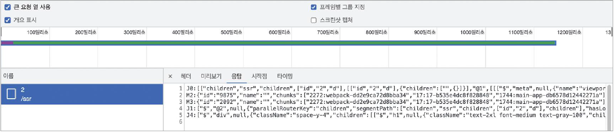
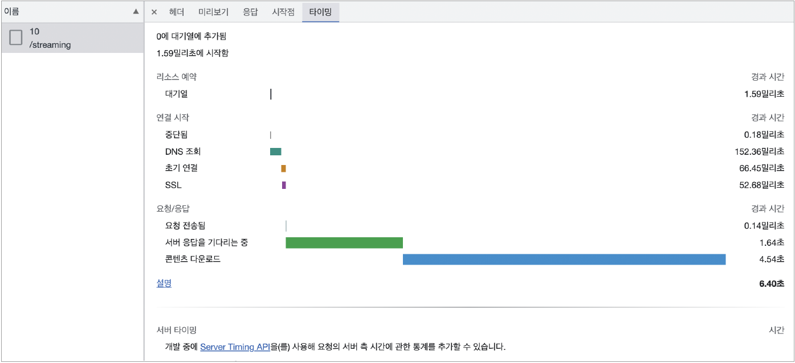

# 11 Next.js 13과 리액트 18

## 11.7 Next.js 13 코드 맛보기

[예제 코드 저장소](https://github.com/wikibook/react-deep-dive-example/tree/main/chapter11/next13)

### 11.7.1 `getServerSideProps`와 비슷한 서버 사이드 렌더링 구현해 보기

- 이전 버전까지 서버에서 데이터를 불러와서 [하이드레이션](https://velog.io/@hamjw0122/Next.js-Hydration)할 수 있는 방법은 `getServerSideProps`를 비롯한 몇 가지 방법으로 제한돼 있었다.
- <b>Next.js 13</b>과 <b>리액트 18</b>에서는 서버 컴포넌트라면 어디든 서버 관련 코드를 추가할 수 있다.
- 서버 컴포넌트에서 `fetch`를 수행하고, 이 `fetch`에 별다른 `cache` 옵션을 제공하지 않는다면 기존의 `getServerSideProps`와 매우 유사하게 작동한다.
- 페이지에서 id를 가져와 렌더링을 수행하는 일반적인 서버 컴포넌트 예제

  ```js
  import { ReactNode } from 'react'

  import { fetchPostById } from '#services/server'

  export default async function Page({
    params,
  }: {
    params: { id: string }
    children?: ReactNode
  }) {
    // const response = await fetch(
    // `https://jsonplaceholder.typicode.com/posts/${id}`,
    // options,
    // )
    // const data = await response.json()
    // 와 같다.
    const data = await fetchPostById(params.id, { cache: 'no-cache' })

    return (
      <div>
        <h1>{data.title}</h1>
        <p>{data.body}</p>
      </div>
    )
  }
  ```

  - 최초 요청 시 HTML을 살펴보면 기존에 `getServerSideProps`와 마찬가지로 미리 렌더링되어 완성된 HTML이 내려오는 것을 확인할 수 있다.
  - 추가로 눈여겨봐야 할 것은 이 HTML 태그 뒤에 오는 `<script>`이다.

    <details>
    <summary>script</summary>

    ```html
    <script>
      (self.__next_f = self.__next_f || []).push([0]);
    </script>
    <script>
      self.__next_f.push([1, 'J0:"@1"\n']);
    </script>
    <script>
      self.__next_f.push([
      1,
      'M2:{"id":"7954","name":"","chunks":["2272:webpack-dd2e9ca72d8bba34","17:17-b535e4dc8f828848","
      1744:main-app-db6578d12442271a"],"async":false}\nM3:{"id":"7043","name":"","chunks":[
      "2272:webpack-dd2e9ca72d8bba34","17:17-b535e4dc8f828848","1744:main-app-db6578d12442271a"],"async":
      false}\nM4:{"id":"777","name":"","chunks":["4090:4090-c9300f314eb60af2","3185:app/layout-
      3e60bee48dd67f90"],"async":false}\nM5:{"id":"9875","name":"","chunks":["2272:webpack-
      dd2e9ca72d8bba34","17:17-b535e4dc8f828848","1744:main-app-db657',
      ])
    </script>
    <!-- 이하 생략 -->
    <script>
      self.__next_f.push([
      1,
      'J9:["$","div",null,{"className":"space-y-4","children":[["$","h1",null,{"className":"text-2xl
      font-medium text-gray-100","children":"sunt aut facere repellat provident occaecati excepturi optio
      reprehenderit"}],["$","p",null,{"className":"font-medium text-gray-400","children":"quia et suscipit\\
      nsuscipit recusandae consequuntur expedita et cum\\nreprehenderit molestiae ut ut quas totam\\nnostrum
      rerum est autem sunt rem eveniet architecto"}]]}]\n',
      ])
    </script>
    ```

    </details>

  - 과거 `getServerSideProps`를 사용하는 애플리케이션에서는 `<script id="__NEXT_DATA__" type="application/json">`라고 하는 특별한 태그가 추가돼 있었고, 이 서버에서 미리 만들어진 정보를 바탕으로 클라이언트에서 하이드레이션을 수행했었다.
  - 리액트 18에서는 서버 컴포넌트에서 렌더링한 결과를 직렬화 가능한(JSON.stringify가 가능한) 데이터로 클라이언트에 제공하고, 클라이언트는 이를 바탕으로 하이드레이션을 진행하게 된다.
  - 각 스크립트는 하나의 서버 컴포넌트 단위를 의미하며, 예제 코드의 마지막 스크립트에서 이 마지막 서버 컴포넌트의 흔적을 발견할 수 있다.
  - 다른 id를 선택하고 개발자도구의 네트워크 탭을 확인하면 응답으로 컴포넌트 구조가 점진적으로 제공되는 것을 확인할 수 있다
    <div>
        
    </div>

### 11.7.2 `getStaticProps`와 비슷한 정적인 페이지 렌더링 구현해 보기

- Next.js 13 이전까지는 정적 페이지 생성을 위해 `getStaticProps`나 `getStaticPaths`를 이용해 사전에 미리 생성 가능한 경로(path)를 모아둔 다음, 이 경로에 대해 내려줄 props를 미리 빌드하는 형식으로 구성 되어 있었다.
- 이러한 방법은 [헤드리스(headless) CMS](https://aws.amazon.com/ko/what-is/headless-cms/) 같이 사용자 요청에 앞서 미리 빌드해둘 수 있는 페이지를 생성하는 데 매우 효과적이었다.

  ```js
  // /app/ssg/[id]/page.tsx
  import { fetchPostById } from '#services/server';

  export async function generateStaticParams() {
    return [{ id: '1' }, { id: '2' }, { id: '3' }, { id: '4' }];
  }

  export default async function Page({ params }: { params: { id: string } }) {
    // const response = await fetch(
    // `https://jsonplaceholder.typicode.com/posts/${id}`,
    // options,
    // )
    // const data = await response.json()
    // 와 같다.
    const data = await fetchPostById(params.id);

    return (
      <div>
        <h1>{data.title}</h1>
        <p>{data.body}</p>
      </div>
    );
  }
  ```

  - `generateStaticParams`를 사용해 주소인 `'/app/ssg/[id]'`에서 `[id]`로 사용 가능한 값을 객체 배열로 모아두고, `Page` 컴포넌트에서는 이 각각의 `id`를 `props`로 받을 때 어떻게 작동할지 미리 정해두었다.
  - 이전 서버 사이드 렌더링 예제와 다르게 `fetchPostById`에는 별다른 옵션을 주지 않았다.

- <b>Incremental Static Regeneration</b>

  - 정적으로 미리 빌드해 두는 것뿐만 아니라 캐시를 활용하는 것도 가능하다.
  - 정적으로 생성된 페이지를 점진적으로 갱신하는 방법
  - 일정 기간 동안 캐시를 가져와 빠르게 렌더링하고, 시간이 지나면 새롭게 데이터를 불러오는 방식으로 페이지를 구성할 수 있다.

  ```js
  // 페이지의 캐시가 60초간 유효하다
  export const revalidate = 60;

  export async function generateStaticParams() {
    return [{ id: '1' }, { id: '2' }, { id: '3' }, { id: '4' }];
  }

  export default async function Page({ params }: { params: { id: string } }) {
    const response = await fetch(
      `https://jsonplaceholder.typicode.com/posts/${id}`
    );
    const data: Post = await response.json();

    return (
      <>
        <div>
          마지막 렌더링 시간 (프로덕션 모드만 확인 가능): UTC{' '}
          {new Date().toLocaleTimeString()}
        </div>
        <h1>{data.title}</h1>
        <p>{data.body}</p>
      </>
    );
  }
  ```

  - 최초 방문 시 미리 빌드해 둔 페이지를 렌더링해서 내려준다.
  - 캐시 유효시간이 지난 이후에 다시 페이지를 방문하면 서버에서 페이지를 다시 생성하면서 <b>마지막 렌더링 시간</b>이 갱신되는 것을 알 수 있다.
  - 서버 컴포넌트이므로 `new Date()`는 서버에서 빌드되는 시점을 의미하므로 실제로 캐시가 유효한지 확인하기 적합하다.

### 11.7.3 로딩, 스트리밍, 서스펜스

- Next.js 13에서는 스트리밍(streaming)과 리액트의 서스펜스(suspense)를 활용해 컴포넌트가 렌더링 중이라는 것을 나타낼 수 있다

  ```js
  // [id]/page.tsx
  import { Suspense } from 'react';

  export default async function Page({ params }: { params: { id: string } }) {
    return (
      <div className="space-y-8 lg:space-y-14">
        <Suspense fallback={<div>유저 목록을 로딩 중입니다.</div>}>
          {/* 타입스크립트에서 Promise 컴포넌트에 대해 에러를 내기 때문에 임시 처리 */}
          {/* @ts-expect-error Async Server Component */}
          <Users />
        </Suspense>

        <Suspense
          fallback={<div>유저 {params.id}의 작성 글을 로딩 중입니다.</div>}
        >
          {/* @ts-expect-error Async Server Component */}
          <PostByUserId userId={params.id} />
        </Suspense>
      </div>
    );
  }

  export async function Users() {
    // Suspense를 보기 위해 강제로 지연시킨다.
    await sleep(3 * 1000);
    const users = await fetchUsers();

    return (
      <ul>
        {users.map((user) => (
          <li key={user.id}>{user.name}</li>
        ))}
      </ul>
    );
  }

  export async function PostByUserId({ userId }: { userId: string }) {
    // Suspense를 보기 위해 강제로 지연시킨다.
    await sleep(5 * 1000);

    const allPosts = await fetchPosts();
    const posts = allPosts.filter(
      (post) => post.userId === parseInt(userId, 10)
    );

    return (
      <ul>
        {posts.map((post) => (
          <li key={post.id}>{post.title}</li>
        ))}
      </ul>
    );
  }
  ```

  - fetch 작업이 완료되면서 화면이 렌더링되고, 페이지 렌더링에 소요된 시간만큼 네트워크 요청이 발생한다
    <div>
        
    </div>
