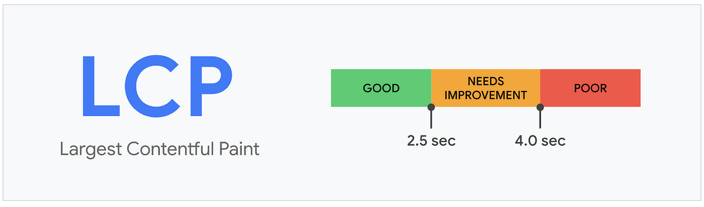
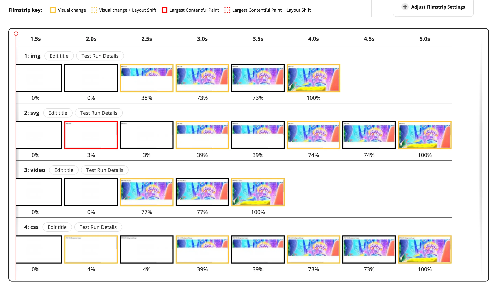
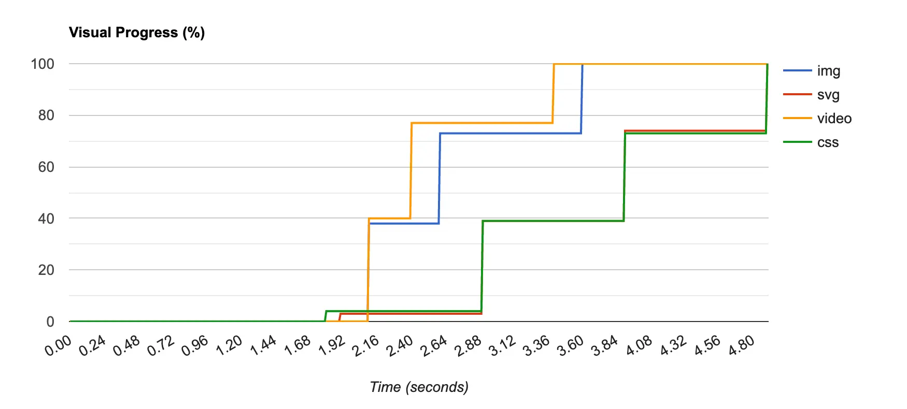

# 최대 콘텐츠풀 페인트 (LCP)

### 정의

- 최대 콘텐츠풀 페인트 (Largest Contentful Paint): 페이지가 처음으로 로드를 시작한 시점부터 뷰포트 내부에서 가장 큰 이미지 또는 텍스트를 렌더링하는 데 걸리는 시간
- 뷰포트: 사용자에게 현재 노출되는 화면

#### ☑️ 뷰포트 내부에서 '큰 이미지와 텍스트'

- \
- \<svg> 내부의 \
- poster 속성을 사용하는 \<video>
- url()을 통해 불러온 배경 이미지가 있는 요소
- 텍스트와 같이 인라인 텍스트 요소를 포함하고 있는 블록 레벨 요소 (\<p>, \<div>)

즉, 최대 콘텐츠풀 페인트란 사용자의 **기기가 노출하는 뷰포트 내부에서 가장 큰 영역을 차지하는 요소가 렌더링되는 데 얼마나 걸리는지**를 측정하는 지표

### 의미

사용자에게 페이지의 정보를 화면에 전달하는 속도를 객관적으로 판단하기 위한 지표

- 개발자 입장에서의 '웹페이지가 로딩이 완료되어 사용자에게 노출되어 걸리는 시간' : `DOMContentLoaded` 이벤트가 호출되는 시간
- 사용자가 인식하는 페이지의 로딩 시점: 사용자에게 노출되는 부분만 로딩되어 있어도 페이지 로딩이 완료되었다고 느낌

### 예제

[네이버 스포츠 탭](https://sports.news.naver.com/index)

네트워크 탭에서 속도 조절 후 로딩 시간 확인

### 기준 점수

<div style="display: flex; align-items: start; justify-content: center; gap: 10px;">
  
</div>

<br/>

- 점수 측정법: 자바스크립트 API를 호출하는 방법, **다른 도구를 사용하는 방법**
- LCP에서 좋은 점수란 해당 지표가 2.5초 내로 응답이 오는 것. 4초 이내는 보통, 그 이상이 걸리면 나쁨으로 판단

### 개선 방안

#### ☑️ 텍스트는 언제나 옳다

- 뷰포트 최대 영역에 이미지 대신 문자열을 넣는 것
- 이미지를 아무리 최적화해도 이미지보다 텍스트 노출이 훨씬 빠름

#### ☑️ 이미지는 어떻게 불러올 것인가?

```html
<!-- 1) img -->


<!-- 2) svg -->
<svg xmlns="...">
  <image href="..." />
</svg>

<!-- 3) 비디오의 경우 (video.poster) -->
<video poster="..."></video>

<!-- 4) background-image: url() -->
<div style="..."></div>
```

<br/>

<div style="text-align: center;">
  
  
</div>

<br/>

1. \ : 이미지는 브라우저의 프리로트 스캐너에 의해서 먼저 발견되어 빠르게 요청이 일어난다. 때문에 최대 콘텐츠풀 페인트 요소를 불러오기에 적절한 방법이다.
2. \<svg> : \<svg> 내부의 \는 프리로드 스캐너에 의해 발견되지 않아 다운로드가 일어나지 않아, 이는 최대 콘텐츠풀 페인트 점수에 악영향을 미친다.
3. \<video>의 poster : poster는 사용자가 video 요소를 재생하거나 탐색하지 전까지 노출되는 요소다. 이 역시 프리로드 스캐너에 의해 조기에 발견되어 \와 같은 성능을 나타낸다. 만약 poster가 없는 경우 video를 실제로 로딩해 첫 번째 프레임을 poster로 대체하기 때문에 최대 콘텐츠풀 페인트에 영향을 받을 것 같다면 poster를 반드시 넣어주는 것이 좋다.
4. background-image : 이를 비롯한 CSS에 있는 리소스들을 항상 느리기 때문에, 최대 콘텐츠풀 페인트에 별로 좋은 영향을 미치지 않는다.

#### ☑️ 그 밖에 조심해야 할 사항

- 이미지 무손실 압축: 이미지는 가능한 한 무손실 형식으로 압축해 최소한의 용량으로 서비스하는 것이 좋다.
- loading=lazy 주의: 리소스를 중요하지 않음으로 표시하고 필요할 때만 로드하는 전략으로, 최대 콘텐츠풀 이미지에 사용하면 로딩 속도만 늦추기 때문에 이에 사용하지 않는 것이 좋다.
- fadein과 같은 각종 애니메이션: 이미지가 그냥 뜨는 것보다 최대 콘텐츠풀 페인트도 그만큼 늦어진다.
- 클라이언트에서 빌드하지 말 것: 서버에서 미리 빌드된 채로 오는 것이 좋다.
- 최대 콘텐츠풀 리소스는 직접 호스팅: 가능한 최대 콘텐츠풀 리소스는 같은 도메인에서 직접 호스팅하는 것이 좋다.
