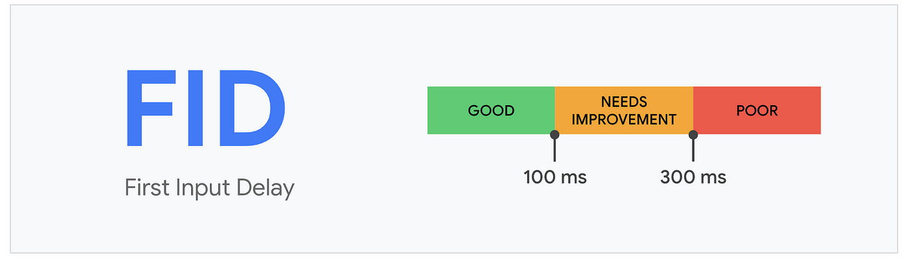

# 최초 입력 지연 (FID)

### 정의

- 최초 입력 지연 (First Input Delay): 사용자가 페이지와 처음 상호 작용할 때부터 해당 상호 작용에 대한 응답으로 브라우저가 실제로 이벤트 핸들러 처리를 시작하기까지의 시간
- 사용자가 얼마나 빠르게 웹페이지와의 상호 작용에 대한 응답을 받을 수 있는지 측정하는 지표

### 의미

- 웹사이트 내부의 이벤트가 반응이 늦어지는 이유는 대부분 해당 입력을 처리해야 하는 브라우저의 메인 스레드가 바쁘기 때문임
- 이벤트가 발생하는 시점에 최대한 메인 스레드가 다른 작업을 처리할 수 있도록 여유를 만들어 둬야 사용자에게 빠른 반응성을 보장할 수 있음

#### ☑️ 사용자 경험 (RAIL)

- Response: 사용자의 입력에 대한 반응 속도. 50ms 미만으로 이벤트를 처리할 것
- Animation: 애니메이션 각 프레임을 10ms 이하로 생성할 것
- Idle: 유효 시간을 극대화해 페이지가 50ms 이내에 사용자 입력에 응답하도록 할 것
- Load: 5초 이내에 콘텐츠를 전달하고 인터랙션을 준비할 것

최초 입력 지연은 응답에 초점을 맞추고 잇으며, 화면이 최초에 그려지고 난 뒤 사용자가 웹페이지에서 클릭 등 상호작용을 수행했을 때 메인 스레드가 이 이벤트가 대한 반응을 할 수 있을 때까지 걸리는 시간을 의미한다.

### 예제

[네이버 스포츠 탭](https://sports.news.naver.com/index)

퍼포먼스 탭에서 확인 가능한 것 같음 😭

### 기준 점수

  

 

- LCP에서 좋은 점수란 해당 지표가 100ms 내로 응답이 오는 것. 300ms 이내는 보통, 그 이후의 경우에는 나쁨으로 판단

### 개선 방안

#### ☑️ 실행에 오래 걸리는 긴 작업을 분리

- 메인 스레드가 처리에 오래 걸리는 작업이 있으면 최초 입력 지연뿐만 아니라 웹페이지 전반에 악영향을 미치기 때문에 긴 작업이 있다면 여러 개로 분리하는 것이 좋다.
- 작업을 분리하는 것은 단순히 실행이 오래 걸릴 것 같은 작업을 분리하는 것뿐만 아니라 웹페이지 최초 로딩에 필요하지 않은 내용을 나중에 불러오는 것도 포함된다.

#### ☑️ 자바스크립트 코드 최소화

- 번들러가 코드를 만들어주는 과정에서 어느 정도 필요없는 코드를 제거해주고 있지만, 경우에 따라 웹페이지를 불러오는 데 사용되지 않는 필요 없는 코드가 존재할 수 있기 떄문에, 크롬 개발자 도구를 통해 확인하는 것이 좋다.
- 브라우저에서 지원하지 않는 기능을 사용하기 위해 웹페이지에서 직접 구현하고 집어넣는 코드인 '폴리필'이 코드에 있을 경우, 반드시 폴리필이 필요한 환경인지, 꼭 필요한 폴리필인지를 확인한 후 사용한다.

#### ☑️ 타사 자바스크립트 코드 실행의 지연

- 타사 자바스크립트 코드(예: 구글 애널리틱스, 파이어베이스)로 인해 메인 스레드가 잠시 점유되고, 사용자에게 안 좋은 반응성을 제공한다면 문제가 발생할 수 있다.
- 타사 스크립트는 대부분 웹페이지 로드에 중요한 자원이 아니므로 `async`나 `defer`을 사용하여 지연 불러오기를 하는 것이 좋다.
- `defer`: 해당 스크립트의 실행은 페이지가 완전히 로딩된 이후에 맨 마지막에 실행된다.
- `async`: 다른 리소스와 병렬로 다운로드하기 때문에 다운로드가 완료된 순서대로 실행된다.
- 둘 다 없는 경우: script를 만나는 순간 다운로드가 우선되며, 다운로드가 완료되면 코드 실행이 우선된다. 다른 작업은 다운로드와 실행이 끝날 때까지 미뤄진다.
