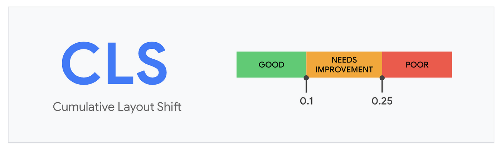
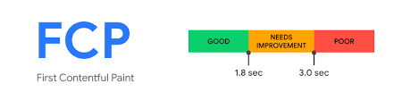

# 누적 레이아웃 이동 (CLS)

### 정의

- 페이지의 생명주기 동안 발생하는 모든 예기치 않은 이동에 대한 지표를 계산하는 것

### 의미

- 뷰포트 내부에서만 측정
- 최초 렌더링이 시작된 위치에서 만약 레이아웃의 이동이 발생한다면 누적 레이아웃 이동 점수로 기록하게 됨
- 영향분율: 레이아웃 이동이 발생한 요소의 전체 높이와 뷰포트 높이의 비율를 의미
- 거리분율: 레이아웃 이동이 발생한 뷰포트 대비 얼마나 이동했는지를 의미
- 위의 두 가지 점수를 곱해서 최종 점수를 계산

### 예제

[아마존](https://www.amazon.com/)

useEffect 호출에 따른 결과로 나타나는 배너가 노출된 크기만큼 전체 웹사이트의 콘텐츠가 아래로 밀림 🤗

### 기준 점수

  

 

- 누적 레이아웃 이동의 경우 0.1 이하의 경우 좋음, 0.25 이하인 경우 보통이며 그 외에는 개선이 필요한 나쁨으로 판단

### 개선 방안

#### ☑️ 삽입이 예상되는 요소를 위한 추가적인 공간 확보

- 대부분의 큰 누적 레이아웃 이동은 클라이언트에서 삽입되는 동적인 요소로 인해 발생
- 이러한 영향을 받는 것을 미연에 방지하기 위해서 useEffect의 내부에서 요소에 영향을 미치는 작업, 특히 뷰포트 내부에서 노출될 확률이 높은 작업을 최소화하는 것이 좋음
- 서버 사이드 렌더링이 가장 좋은 방법

#### ☑️ 폰트 로딩 최적화

- FOUT: HTML 문서에서 지정한 폰트가 보이지 않고 대체 기본 폰트로 보이고 있다가 뒤늦게 폰트가 적용되는 현상
- FOIT: 문서에서 지정한 폰트가 보이지 않고 기본 폰트도 없어서 텍스트가 없는 채로 있다가 뒤늦게 폰트가 로딩되면서 페이지에 렌더링되는 현상

폰트로 인해 발생할 수 있는 문제는 다음과 같다. 이를 방지하기 위해서는 아래의 방식 중 두 가지 방법을 조합해 불러오는 것이 좋다. 이 우선순위를 활용했음에도 빠르게 로딩하는 데 실패했다면 기본 폰트를 노출한다.

- \<link>의 preload 사용: 페이지에서 즉시 필요로 하는 리소스를 명시하는 기능
- font-family: auto, block, swap, fallback, optional 등 다양한 방식으로 폰트를 불러올 수 있다.

#### ☑️ 적절한 이미지 크기 설정

- 반응형 웹사이트가 도입되면서, 불러온 이미지가 기기의 너비 및 높이에 따라 자동으로 비례해서 설정되어 누적 레이아웃이 커질 수 있다.
- 이는 사용자에게 최적의 이미지를 보여줄 수 있으나, 이미지의 높이를 명확하게 알지 못하기 때문에 레이아웃 이동이 크게 발생한다.
- width, height를 지정하는 것이 가장 좋은 방법이고, aspect-ratio 속성으로 가로세로 비율을 맞춘다.
- 반응형 이미지를 사용하고 싶다면 srcset 속성을 사용하는 것이 좋다.

### 핵심 웹 지표는 아니지만 성능 확인에 중요한 지표들

#### ☑️ 최초 바이트까지의 시간 (TTFB)

- 브라우저가 웹페이지의 첫 번째 바이트를 수신하는 데 걸리는 시간을 의미한다.
- 페이지를 요청했을 때 요청이 완전히 완료되는 데 거리는 시간을 측정하는 것이 아니라 최초의 응답이 오는 바이트까지나 얼마나 걸리는지를 측정하는 지표다.
- 특히 서버 사이드 렌더링을 하고 있는 애플리케이션에서 주의 깊게 봐야 할 지표다.

#### ☑️ 최초 콘텐츠풀 페인트 (FCP)

- 최초 콘텐츠풀 페인트(First Contentful Paint)란 페이지가 로드되기 시작한 시점부터 페이지 콘텐츠의 일부가 화면에 렌더링될 때까지의 시간을 측정한다.
- 웹사이트에 접속한 순간부터 페이지에 뭐라도 뜨기 시작한 시점까지의 시간

  

 

- 최초 콘텐츠풀 페인트는 1.8초 이내에 이뤄진다면 좋음, 3.0초 이내는 보통, 그 이후는 개선이 필요한 것으로 보고된다.
