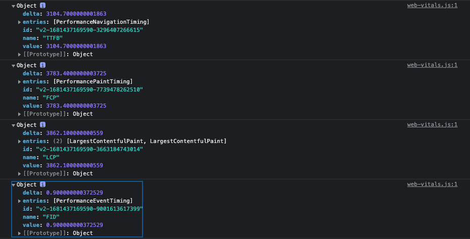
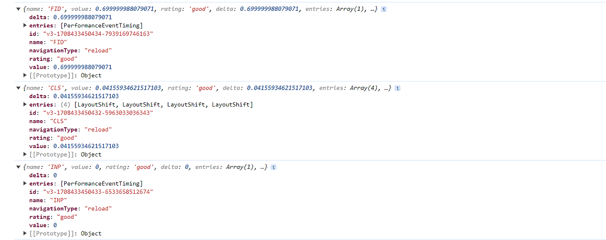

# 애플리케이션에서 확인하기

### create-react-app

```javascript
const reportWebVitals = (onPerfEntry) => {
  if (onPerfEntry && onPerfEntry instanceof Function) {
    import("web-vitals").then(
      ({ getCLS, getFID, getFCP, getLCP, getTTFB }) => {
        getCLS(onPerfEntry);
        getFID(onPerfEntry);
        getFCP(onPerfEntry);
        getLCP(onPerfEntry);
        getTTFB(onPerfEntry);
      }
    );
  }
};

export default reportWebVitals;
```

<div style="display: flex; align-items: start; justify-content: center; gap: 10px;">
  
</div>

<br />

- `create-react-app`을 하면 파일에 자동으로 `reportWebVitals`가 생성됨
- `reportWebVitals`는 `web-vitals` 라이브러리를 통해 누적 레이아웃 이동, 최초 입력 지연, 최초 콘텐츠풀 페인트, 최대 콘텐츠 페인팅, 첫 바이트까지의 시간을 측정할 수 있음
- ReportHandler는 성능 객체인 Metric을 인수로 받는 함수 타입이기 때문에, 단순히 콘솔에 출력하는 것 뿐만 아니라 서버로 전송하거나 구글 애널리틱스로 전송하는 등의 작업을 할 수 있음

### create-next-app

```javascript
import { useReportWebVitals } from "next/web-vitals";

function MyApp({ Component, pageProps }) {
  useReportWebVitals((metric) => {
    console.log(metric);
  });

  return <Component {...pageProps} />;
}
```

<div style="display: flex; align-items: start; justify-content: center; gap: 10px;">
  
</div>

<br />

- Next.js의 경우에도 `reportWebVitals`를 생성하면 성능 지표 결과를 확인할 수 있음
- Next.js는 기본적인 핵심 웹 지표 외에도 Next.js에 특화된 사용자 지표를 제공함
  - Next.js-hydration: 페이지가 서버 사이드에서 렌더링되어 하이드레이션하는 데 걸린 시간
  - Next.js-route-change-to-render: 페이지가 경로를 변경한 후 페이지 렌더링을 시작하는 데 걸리는 시간
  - Next.js-render: 경로 변경이 완료된 후 페이지를 렌더링하는 데 걸린 시간
