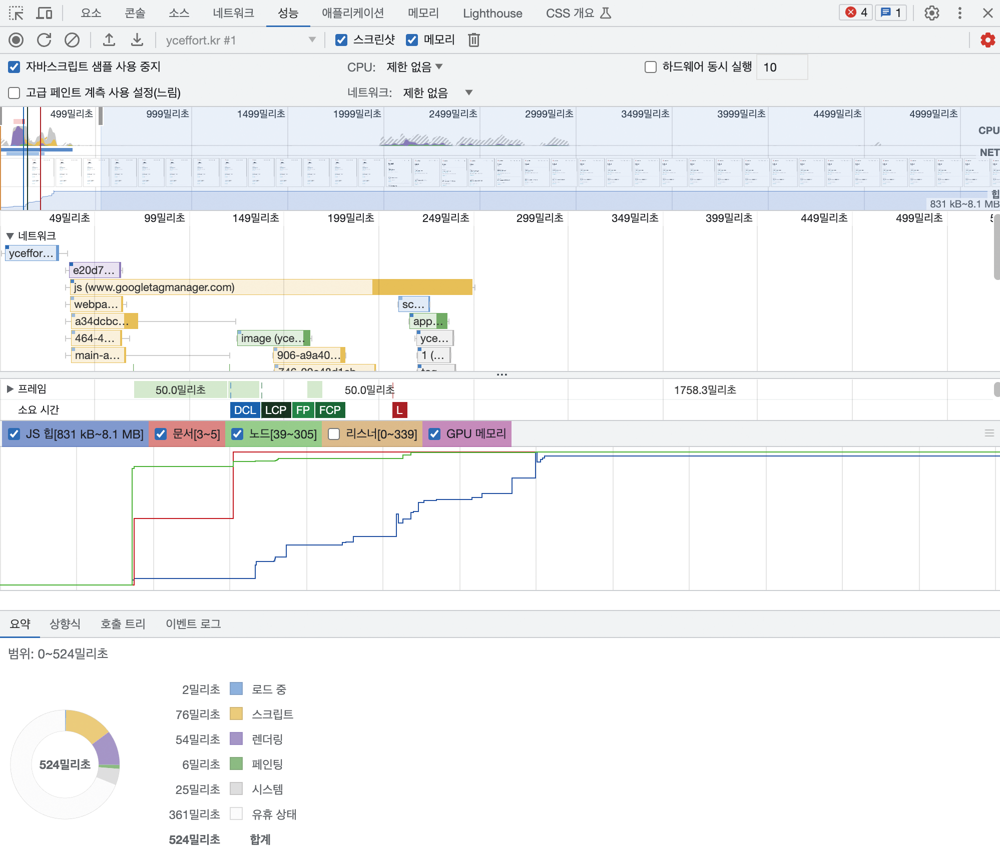
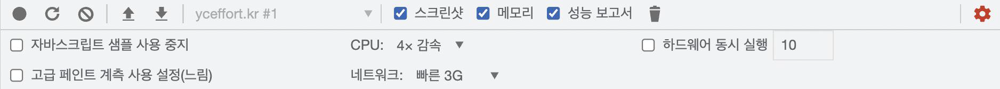
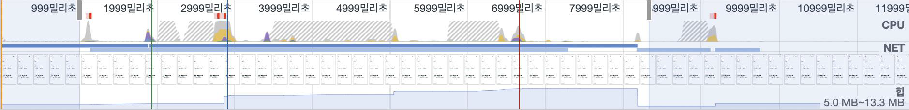
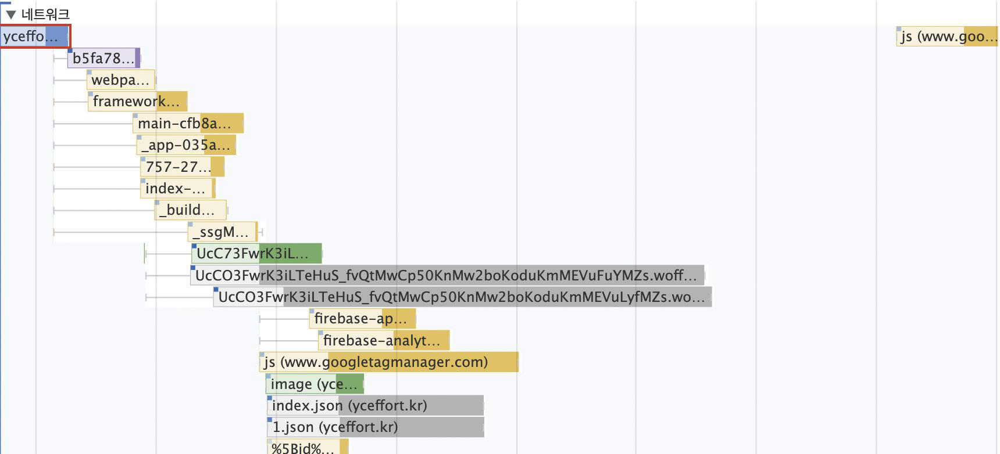
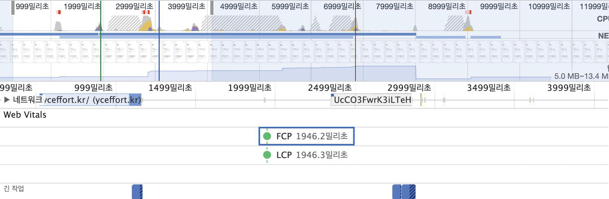
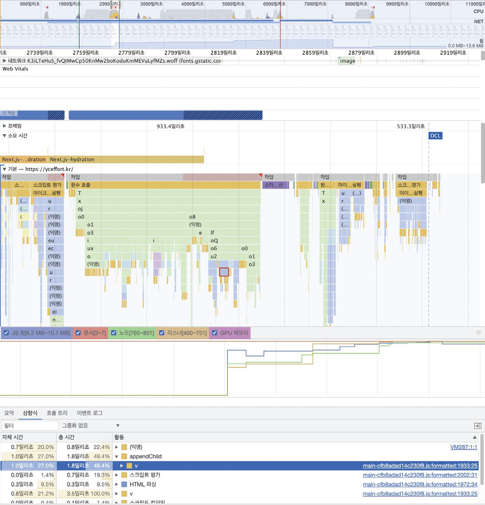

# 13 웹페이지의 성능을 측정하는 다양한 방법

## 13.4 크롬 개발자 도구

### 13.4.1 성능 통계

> 2025년 3월 현재 [지원 중단](https://developer.chrome.com/blog/insights-panel-deprecation?hl=ko)

- `Page Load`를 선택해 웹사이트의 로딩 시작부터 끝까지를 확인하거나, `Start Recording`을 누르고 원하는 액션을 수행하면서 웹사이트 성능을 측정할 수 있다.
- `Throttling`을 사용하여 고의로 네트워크와 CPU 속도를 지연시킬 수 있다.
  - 이를 통해 최신 디바이스 성능이 아닌, 일반적인 모바일 사용자의 상대적으로 열악한 환경을 재현할 수 있다.
- 개발자 도구 탭으로 인해 뷰포트가 잘린다면 실제로 잘린 만큼만 측정하기 때문에 반드시 뷰포트를 실제 사용자가 보는 크기만큼 설정해야 한다.
    <div>
        
    </div>

#### Insights

- 성능을 측정하는 기간 동안 발생한 이벤트 중 눈여겨봐야 할 내용을 시간의 흐름에 따라 모아서 보여준다.
<div>
    
</div>

- 핵심 웹 지표
  - 핵심 웹 지표인 최초 콘텐츠풀 페인트(FCP), 최대 콘텐츠풀 페인트(LCP), 그리고 Dom Content Loaded가 언제 일어났는지 보여준다.
  - 최대 콘텐츠풀 페인트의 경우 마우스를 가져다 대면 어떤 요소가 최대 콘텐츠풀 페인트인지 확인할 수 있다.
- Performance Measure
  - [User Timing API](https://www.w3.org/TR/user-timing/)로 측정한 지표들을 확인할 수 있다.
  - Next.js로 제작된 앱이라면 이 API를 사용한 흔적을 볼 수 있다.
- Long Task
  - Performance Insight의 Insights 탭에서 가장 주목해야 할 것 중 하나다.
  - 이 작업은 메인 스레드에서 실행되는 데 오랜 시간으로 분류된 긴 작업을 의미한다.
- Render blocking Request
  - 어떠한 리소스가 렌더링을 막고 있는지 알 수 있다.
    <div>
        
    </div>
  - 위의 경우 CSS가 렌더링을 막는 것을 볼 수 있다.
  - `<head>`에 있는 스타일은 중요 스타일로 분류되어 반드시 다운로드와 후처리가 끝난 후에 렌더링이 재개된다. 따라서 `<head>` 내부의 스타일은 반드시 뷰포트에서 필요한 스타일만 존재하는 것이 이상적이다.
  - 위의 경우 조치할 수 있는 방법은 크게 3가지이다.
    - 중요하지 않은 스타일이라면 `link rel="preload" as="style"`로 스타일을 비동기적으로 요청한다.
    - 미디어 쿼리를 활용해 디바이스에 필요한 스타일만 불러온다.
    - CSS 내부의 띄어쓰기, 줄바꿈 등을 압축해 최대한 크기를 줄인다.
- Forced Style recalculation
  - 이미 스타일이 한번 계산된 이후에 어떠한 이유로 스타일이 다시금 계산되는 작업이 강제로 발생했음을 의미한다.
  - 스타일을 재계산하는 일은 많은 리소스가 소요되는 일이므로 가급적 유저가 어떠한 액션을 하지 않은 이상 최초 로딩 시에는 일어나지 않는 것이 좋다.

#### 메인 메뉴

<div>
    
</div>

- 메인 영역에서는 성능을 측정하는 기간 동안 무슨 일이 일어나는지 확인할 수 있는 다양한 기능을 제공한다.

<div>
    
</div>

- 파란색 세로선 기준의 시간 당시에 페이지가 얼마나 완성되어 있는지 확인하고, 시간의 흐름에 다라 화면이 얼마나 그려졌는지 점검할 수 있다.

<div>
    
</div>

- Layout Shifts 영역은 레이아웃 이동이 일어날 경우 기록된다.
- 이 시점에 실행된 스크립트를 살펴보면 무엇이 누적 레이아웃 이동을 발생시키는지 확인할 수 있다.

<div>
    
</div>

- Network에서는 성능 측정 기간 동안 발생한 네트워크 요청을 모두 확인할 수 있다.
- 여기서 각 항목을 선택하면 해당 네트워크 이벤트에 대한 자세한 내용을 알 수 있다.
- 만약 이 네트워크 요청에 대한 더 자세한 내용이 알고 싶다면 해당 파일을 네트워크 탭에서 검색해 보면 된다.

<div>
    
</div>

- Renderer에서는 렌더러가 어떤 작업을 하고 있는지 확인할 수 있다.
- 크기가 큰 작업은 렌더러가 실행하기 위해 많은 시간을 보냈다는 뜻으로, Long task일 가능성이 크며, 성능 개선의 여지가 있음을 나타낸다.
- Timing은 User Timing API와 관련된 기록이 남아 있다.
- 측정하고 싶은 기록이 있다면 다음과 같이 코드를 작성하면 된다.

  ```js
  const mark = 'marA';
  window.performance.mark(mark);
  // 측정하고 싶은 작업을 시작
  window.performance.measure(
    '여기에 적은 메시지가 Timings에 나타납니다.',
    mark
  );
  ```

  - 자세한 내용은 [performance.mark](https://developer.mozilla.org/en-US/docs/Web/API/Performance/mark) 와 [performance.measure](https://developer.mozilla.org/en-US/docs/Web/API/Performance/measure) 공식 문서를 참고하자

### 13.4.2 성능

- Performance Insights 탭에 비해 다소 내용이 어렵고 복잡하지만 그만큼 더 자세한 정보를 조금 더 세밀하게 확인해 볼 수 있다.

<div>
    
</div>

#### 메뉴

<div>
    
</div>

- 성능 탭에서 사용할 수 있는 메뉴를 확인할 수 있다.
- 원을 선택하면 성능 측정이 시작되며, 다시 누르면 성능 측정이 종료된다.
- 새로 고침 버튼을 클릭하면 페이지 로드부터 종료 시점까지 성능 측정이 일어난다.
- 의도적으로 스로틀링을 적용하거나, 측정 프로필을 저장 및 불러올 수 있다.

#### 요약

<div>
    
</div>

- 측정 기간의 CPU, 네트워크 요청, 스크린숏, 메모리 점유율 등을 요약해서 볼 수 있다.
- 드래그를 통해 시점을 선택하고, 해당 시점과 관련된 정보만 하단에 노출시킬 수 있다.

#### 네트워크

<div>
    
</div>

- 성능 측정 기간 동안에 발생한 모든 네트워크 요청을 확인할 수 있다.
- 각 색깔에 따라 어떠한 종류의 요청인지 확인할 수 있다.
  - 파란색: HTML
  - 보라색: CSS
  - 노란색: 자바스크립트
  - 초록색: 이미지
  - 회색: 기타(JSON, 폰트 등)
- 위에 있는 요청이 우선순위가 높은 요청이며, 그래프로 표시되어 있다.
  - 왼쪽 선은 연결을 시작되기 위한 기간을 나타낸다.
  - 대표 색상의 막대 그래프 중 색이 더 연한 왼쪽은 요청을 보내고 최초 바이트가 오기까지의 대기 시간을 의미한다.
  - 대표 색상의 막대 그래프 중 색이 진한 오른쪽은 콘텐츠를 다운로드하는 데 걸리는 시간을 의미한다.
  - 그리고 마지막에 거의 안 보이는 오른쪽 선은 메인 스레드의 응답을 기다리는 시간인데, 이는 네트워크의 소요 시간에 포함하지 않는다.

#### Web vitals

<div>
    
</div>

- 핵심 웹 지표 시점을 확인할 수 있는 영역이다.

#### 소요 시간과 기본

<div>
    
</div>

- 시간의 흐름에 따라 메인 스레드의 작업은 어떻게 이뤄졌는지, 자바스크립트 힙 영역은 어떻게 변화하는지 등을 확인할 수 있다.
