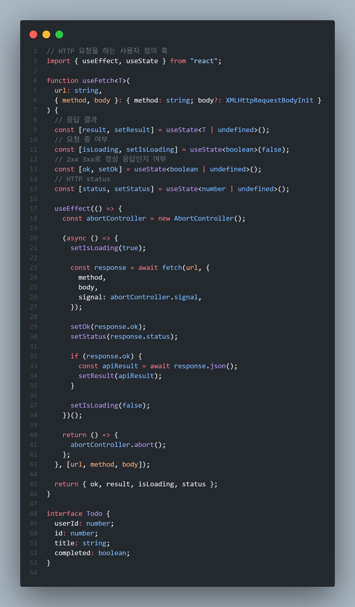
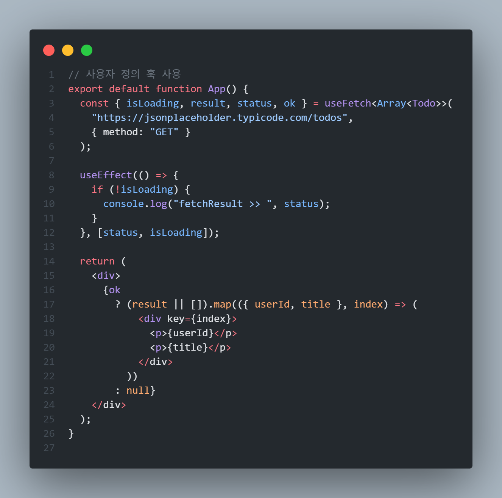
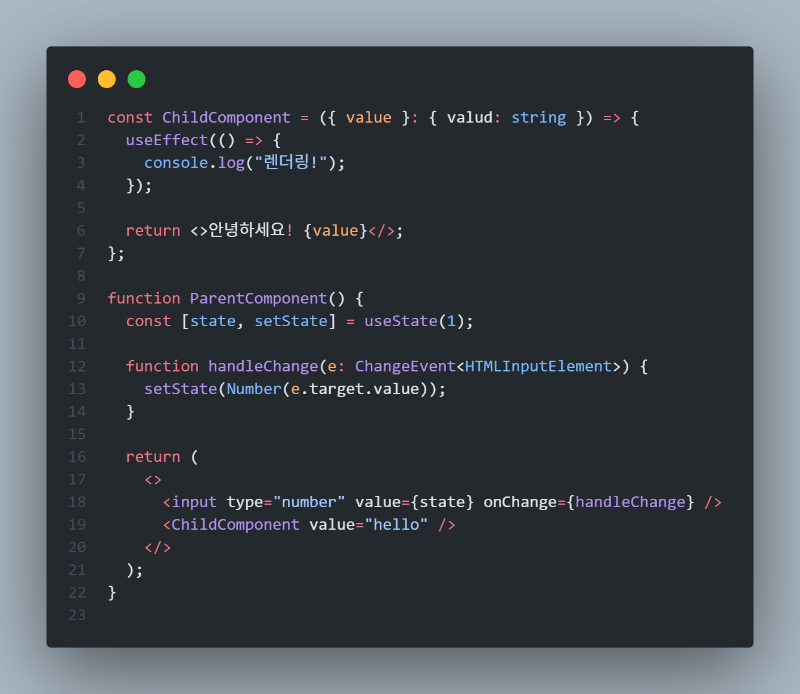
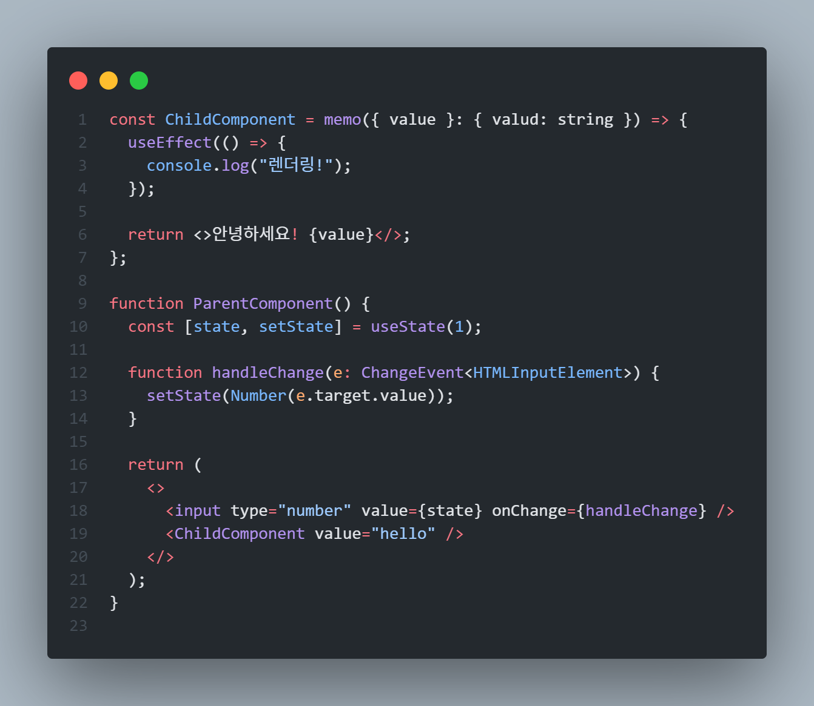
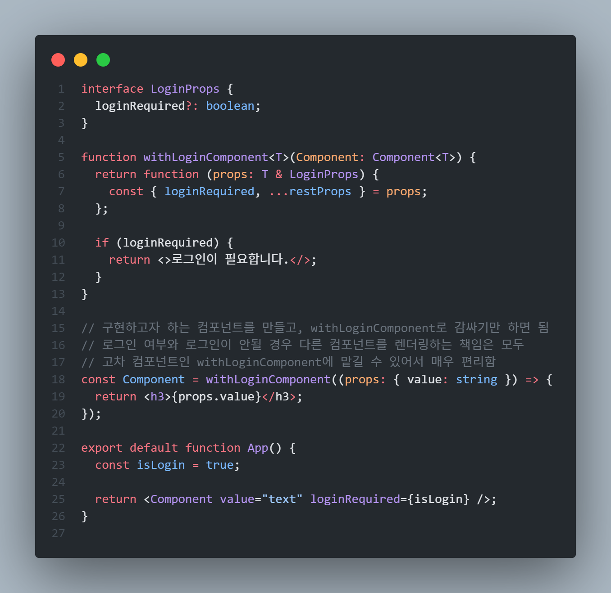

# 사용자 정의 훅과 고차 컴포넌트

- 리액트에서 **재사용**할 수 있는 로직을 관리할 수 있는 두 가지 방식으로 **사용자 정의 훅**(custom hook)과 **고차 컴포넌트**(higher order component)가 있음

### 사용자 정의 훅

- 서로 다른 컴포넌트 내부에서 같은 로직을 공유하고자 할 때 주로 사용됨
- 리액트 훅을 기반으로 개발자가 필요한 훅을 만드는 기법
- 리액트 훅과 동일한 규칙을 적용하여 훅의 이름은 **use**로 시작해야 함

<br/>

<div style="display: flex; align-items: start; justify-content: center; gap: 10px;">
  
  
</div>

<br/>

- 만약 훅으로 분리하지 않았다면 fetch로 API를 호출하는 모든 컴포넌트 내에서 공통적으로 관리하지 않는 최소 4개의 state를 선언해서 각각 구현해야 함
- useReducer로 최적화해도 useEffect가 필요하기 때문에 두 가지 훅을 fetch가 필요한 곳마다 중복해서 사용해야 함
- 하지만? 사용자 정의 훅은 useFetch를 사용하면 중복되는 로직을 손쉽게 관리할 수 있음

#### ☑️ 만약 use로 시작하는 이름을 갖지 않는다면?

```
React Hook "useState" is called funciton "fetch" that is neither
a React function component nor a custom React Hook function.
React Component names must start with an uppercase letter. (react-hooks/rules-of-hooks)
```

- `useFetch`를 `fetch`로 이름을 변경한 상태에서 함수 내부에 useState를 사용하면 다음과 같은 에러가 발생함
- 이 에러를 제거하는 방법은 `fetch`의 앞부분을 대문자로 바꿔 함수 컴포넌트로 알리는 방법, 혹은 **use**를 앞에 붙여 사용자 정의 훅이라고 알리는 방법이 있음

### 고차 컴포넌트

- 컴포넌트 자체의 로직을 재사용하기 위한 방법
- 고차 함수의 일종으로, 리액트가 아니더라도 자바스크립트 환경에서 사용 가능

#### ☑️ React.memo

<div style="display: flex; align-items: start; justify-content: center; gap: 10px;">
  
  
</div>

<br/>

- **React.memo**는 props의 변화가 없음에도 컴포넌트의 렌더링을 방지하기 위해 만들어진 리액트의 고차 컴포넌트임
- React.memo는 렌더링하기 앞서 props를 비교해 이전과 prop가 같다면 렌더링 자체를 생략하고 이전에 기억해 둔(memoization) 컴포넌트를 반환함
- 좌측 코드는 ChildComponent의 props인 `value=hello`가 변경되지 않았음에도 handleChage로 인해 setState를 실행해 state를 변경하므로 리렌더링이 발생함
- 좌측 코드를 memo로 감산 우측 코드는 state가 아무리 변경돼도 ChildComponent를 다시 렌더링하지 않음
- React.memo는 `useMemo`를 사용해서 동일하게 메모이제이션할 수 있으나, 값을 반환받기 때문에 JSX 함수 방식이 아닌 {}을 사용한 할당식을 사용해야 함

#### ☑️ 고차함수 만들기

- 고차함수: 함수를 인수로 받거나 결과로 반환하는 함수
- 예: Array.prototype.map, forEach, reduce 등

```javascript
const list = [1, 2, 3];
const doubleList = list.map((item) => item * 2);
```

```javascript
// 두 값을 더하는 함수
function add(a) {
  return function (b) {
    return a + b;
  };
}

const result = add(1); // 여기서 result는 앞서 반환한 함수를 가리킴
const result2 = result(2); // 비로소 a와 b를 더한 값이 반환됨
```

- add(1)라는 함수를 호출하는 시점에 정보가 a에 포함되어 result로 반환함
- useState에서 state의 값이 클로저에 기억되는 원리와 유사함

#### ☑️ 고차 함수를 활용한 리액트 고차 컴포넌트 만들기

<div align=center>
  
</div>

<br/>

- `withLoginComponent`는 함수를 인수로 받고, 컴포넌트를 반환하는 고차 컴포넌트

<br/>

- 고차 컴포넌트는 컴포넌트 전체를 감쌀 수 있다는 점에서 사용자 정의 훅보다 더 큰 영향력을 컴포넌트에 미칠 수 있음
- 컴포넌트의 이름은 **with**로 시작해야 함
- 부수 효과를 최소화해야 함: 인수로 받는 props를 임의로 수정, 추가, 삭제하는 일이 없어야 함
- 여러 개의 고차 컴포넌트로 컴포넌트를 감쌀 경우 복잡성이 커짐: 결과 예측이 어렵기 때문에 고차 컴포넌트는 최소한으로 사용하는 것이 좋음

### 사용자 정의 훅 vs 고차 컴포넌트

- 사용자 정의 훅과 고차 컴포넌트 모두 어떠한 로직을 공통화에 별도로 관리할 수 있다는 특성을 가지고 있음
- 중복된된 로직을 별도로 분리하여 컴포넌트의 크기를 줄이고 가독성을 향상시키는 데 도움을 줄수 있음

#### ☑️ 사용자 정의 훅이 필요한 경우

- 단순히 useEffect, useState와 같이 리액트에서 제공하는 훅으로만 공통 로직을 격리할 수 있다면 사용자 정의 훅을 사용하는 것이 좋음
- 사용자 정의 훅 그 자체로는 렌더링에 영향을 미치지 않아 부수 효과가 제한적임임
- 컴포넌트 내부에 미치는 영향을 최소화해 개발자가 훅을 원하는 방향으로만 사용할 수 있음
- 단순히 컴포넌트 전반에 걸쳐 동일한 로직으로 값을 제공하거나 특정한 훅의 작동을 취하게 하고 싶다면 사용자 정의 훅을 사용하는 것이 좋음

#### ☑️ 고차 컴포넌트를 사용해야 경우

- 함수 컴포넌트의 반환값, 즉 렌더링의 결과물에도 영향을 미치는 공통 로직이라면 고차 컴포넌트를 사용하는 것이 좋음
