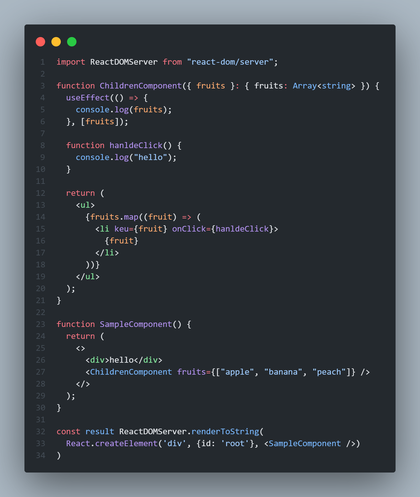
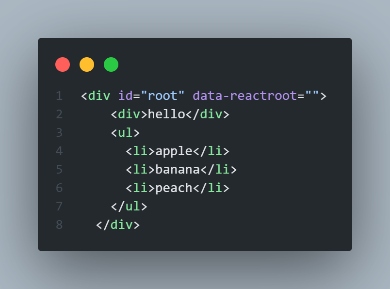
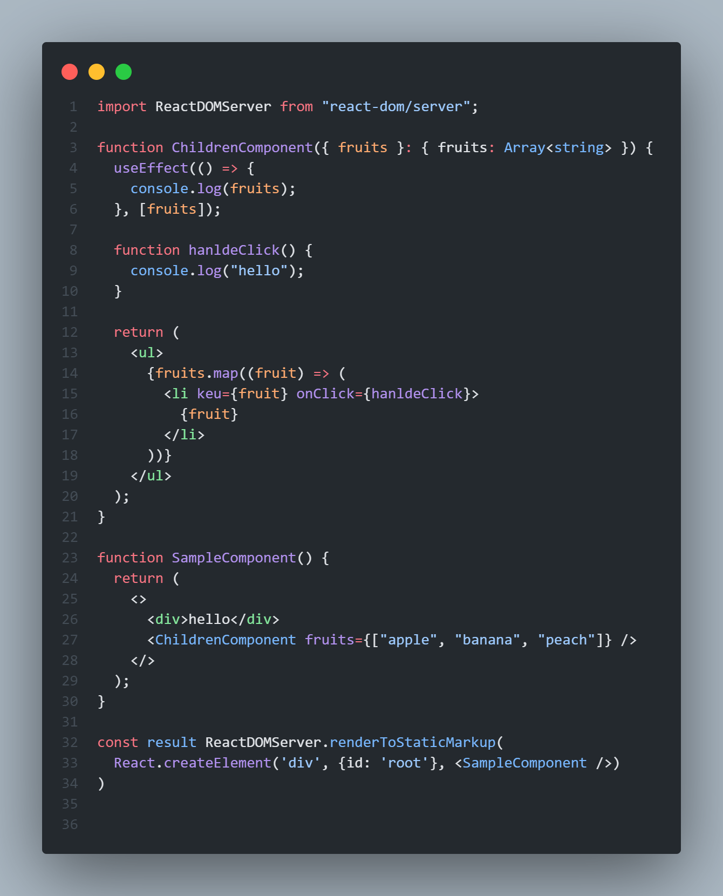
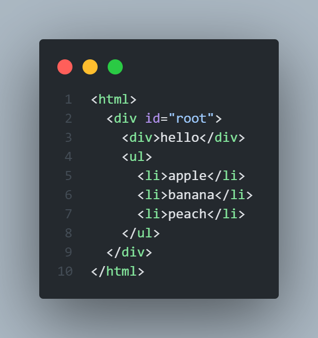
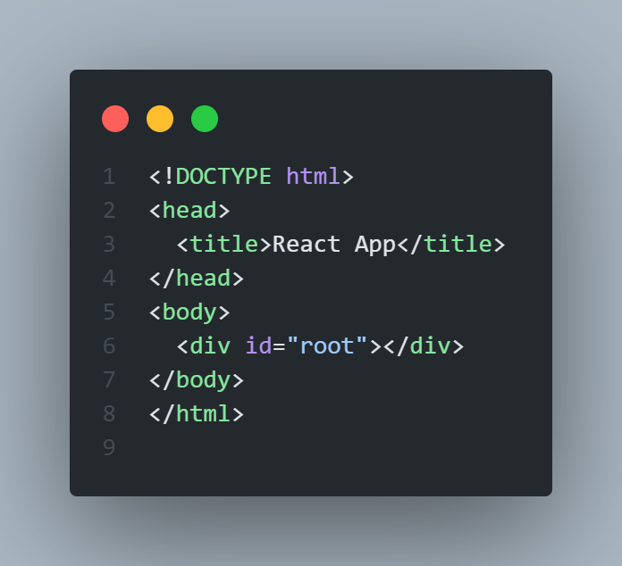
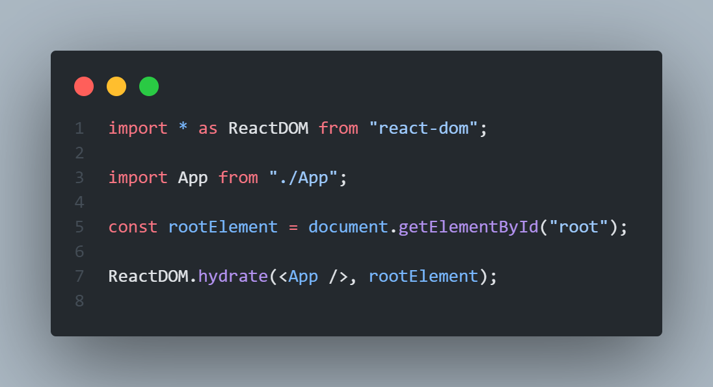

# 서버 사이드 렌더링을 위한 리액트 API

- 리액트는 리액트 애플리케이션을 서버에서 렌더링할 수 있는 API를 제공함
- 이는 Node.js와 같은 서버 환경에서만 실행할 수 있으며 window 환경에서 실행 시 에러가 발생함

### renderToString

- 인수로 넘겨받은 리액트 컴포넌트를 렌더링해 HTML 문자열로 반환하는 함수
- 서버 사이르 렌더링을 구현하는 데 가장 기초적인 API
- 최초의 페이지를 HTML로 먼저 렌더링하는 역할

 

  
  

 

- 좌측의 이미지에서 `ReactDOMServer.renderToString`으로 부모 컴포넌트인 `SampleComponent`를 렌더링하여 루트 컴포넌트인 `
`에서 수행되도록 하여 우측의 이미지인 HTML 코드를 반환함
- `ChildComponent`에 있는 `useEffect`와 같은 훅과 `handleClick`과 같은 이벤트 핸들러는 결과물에 포함되지 않음
- 즉, `renderToString`은 인수로 주어진 리액트 컴포넌트를 기준으로 빠르게 브라우저가 렌더링할 수 있는 HTML을 제공하는 데 목적이 있음 (자바스크립트 코드를 포함시키거나 렌더링하는 역할까지 해주지는 않으며, 필요시 별도로 브라우저에 제공해야 함)
- **`renderToString`을 사용하면 클라이언트에서 실행되지 않고 일단 먼저 완성된 HTML을 서버에서 제공할 수 있으므로 초기 렌더링에서 뛰어난 성능을 보이고, SNS 공유를 위한 메타 정보도 미리 준비한 채로 제공할 수 있으므로 SPA 구조보다 손쉽게 완성할 수 있음**
- `div#root`에 존재하는 속성인 `data-reactroot`는 리액트 컴포넌트가 무슨 엘리먼트인지 식별하는 역할을 함

### renderToStaticMarkup

- 리액트 컴포넌트를 기준으로 HTML 문자열을 만든다는 점에서 `renderToString` 함수와 유사함
- 루트 요소에 추가하는 `data-reactroot`와 같은 리액트에서만 사용하는 추가적인 DOM 속성을 만들지 않는다는 점에서 차이가 있음
- 리액트에서만 사용하는 속성을 제거하면 HTML의 크기를 약간만이라도 줄일 수 있음

 

  
  

 

- 클라이언트에서는 리액트에서 제공하는 `useEffect`와 같은 브라우저 API를 절대로 실행할 수 없음
- `renderToStaticMarkup`은 hydrate를 수행하지 않는다는 가정하에 순수한 HTML만 반환하기 때문에 hydrate를 수행하면 에러를 발생시킴
- 블로그 글이나 상품의 약관 정보와 같이 아무런 브라우저 액션이 없는 정적인 내용만 필요한 경우에 유용함

### renderToNodeStream

- `renderToString`과 결과물이 완전히 동일하나 두 가지 차이점이 있음
- `renderToString`과 `renderToStaticMarkup`은 브라우저에서도 실행할 수는 있지만 `renderToNodeStream`은 브라우저에서 사용하는 것이 완전히 불가능함 (`renderToNodeStream`은 완전히 Node.js 환경에 의존하고 있기 때문임)
- `renderToString`의 결과물은 string인 문자열이지만, `renderToNodeStream`의 결과물은 Node.js의 `ReadableStream`임 (`ReadableStream`이란 utf-8로 인코딩된 바이트 스트림으로, 브라우저가 원하는 string을 얻기 위해서는 추가적인 처리가 필요함)

- 스트림: 큰 데이터를 다룰 때 데이터를 청크로 분할해 조금씩 가져오는 방식
- 생성해야 하는 HTML의 크기가 매우 클 경우, 크기가 큰 문자열을 한 번에 메모리에 올려두고 응답을 수행해야 해서 서버에 큰 부담이 될 수 있음
- **때문에 스트림으로 반환하는 `renderToNodeStream`을 사용하면 큰 크기의 데이터를 청크 단위로 분리해 순차적으로 처리할 수 있음**
- 대부분의 리액트 서버 사이드 렌더링 프레임워크는 모두 `renderToNodeStream` 방식을 채택함

### renderToStaticNodeStream

- `renderToNodeStream`과 제공하는 결과물을 동일하나, 리액트 자바스크립트에 필요한 리액트 속성이 제공되지 않음
- hydrate를 할 필요가 없는 순수 HTML 결과물이 필요할 때 사용함

### hydrate

- `renderToString`과 `renderToNodeStream`으로 생성된 HTML 콘텐츠에 자바스크립트 핸들러나 이벤트를 붙이는 역할 (정적으로 생성된 HTML에 이벤트와 핸들러를 붙여 완전한 웹페이지 결과물을 만듦)

- **render** : 컴포넌트와 HTML의 요소를 인수로 받아 해당 컴포넌트를 렌더링하며, 이벤트 핸들러를 붙이는 작업까지 모두 한 번에 수행함
- **hydrate** : render와 인수를 넘기는 것이 거의 유사하나, 기본적으로 이미 렌더링된 HTML이 있다는 가정하에 작업이 수행되고, 렌더링된 HTML을 기준으로 이벤트를 붙이는 작업만 실행함

 

  
  

 

- 리액트 관련 정보가 없는 순수한 HTML 정보를 넘겨줬을 때, `render`는 빈 HTML에 이 정보를 렌더링하나 `hydrate`는 요소가 없다는 경고 문구를 출력함
- 이미지 기준, rootElement 내부에는 `<App/ >` `<App />`을 렌더링한 정보가 이미 포함되어 있어야만 `hydrate`를 실행할 수 있음
- 단순히 이벤트나 핸들러를 추가하는 것 이외에도 렌더링을 한 번 수행하면서 `hydrate`가 수행한 렌더링 결과물 HTML과 인수로 넘겨받은 HTML을 비교하는 작업을 수행하기 때문임 (여기서 불일치가 발생하면 에러가 발생함)

### 서버 사이드 렌더링 예제 프로젝트

[🔗예제 모음](https://github.com/wikibook/react-deep-dive-example)

- 예제 프로젝트 코드를 통해 설명드립니다😉
