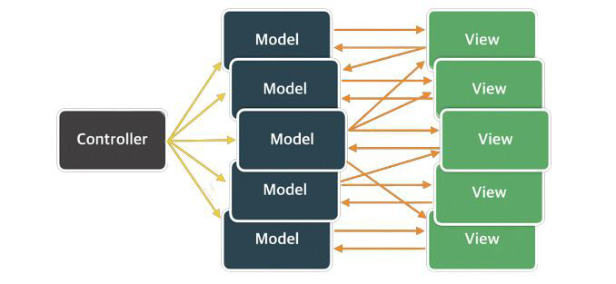
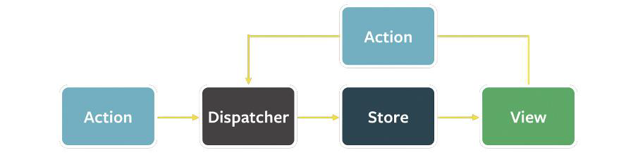

# 리액트와 상태 관리 라이브러리

## 5.1 상태 관리는 왜 필요한가?

> 상태 : 어떠한 의미를 지닌 값, 애플리케이션의 시나리오에 따라 지속적으로 변경될 수 있는 값

- 기본적으로 웹 애플리케이션에서 상태라 함은 상호 작용이 가능한 모든 요소의 현재 값을 의미한다
- 대표적으로 상태로 분류될 수 있는 것

  - UI: 다크/라이트 모드, 라디오를 비롯한 각종 input, 알림창의 노출 여부 등
  - URL: 브라우저에서 관리되고 있는 상태값. https://www.airbnb.co.kr/rooms/34113796?adults=2와 같은 주소가 있다고 가정하면, roomId=34113796과 adults=2라고 하는 상태가 존재하며 이 상태는 사용자의 라우팅에 따라 변경된다
  - 폼(form): 로딩 중인지(loading), 현재 제출됐는지(submit), 접근이 불가능한지(disabled), 값이 유효한지(validation) 등
  - 서버에서 가져온 값: 클라이언트에서 서버로 요청을 통해 가져온 값. API 요청 등

- 웹 서비스에서 제공되는 기능이 많아지며 관리해야 할 상태도 점차 증가하고 있다

### 5.1.1 리액트 상태 관리의 역사

#### ☑️ FLux 패턴의 등장

- `Context API`(16.3 버전에서 등장), `useContext`(16.8 버전에서 등장), 리덕스 등장 전까지 리액트 애플리케이션에서 딱히 이름을 널리 알린 상태 관리 라이브러리는 없었다
- 기존의 웹 애플리케이션에서는 양방향 데이터 바인딩으로 인해 뷰(HTML)가 모델(JavaScript)을 변경할 수 있었으며, 반대의 경우 모델도 뷰를 변경할 수 있었다
  
- 코드가 많아지고 변경 시나리오가 복잡해질수록 관리가 어려워지고, 단방향으로 데이터 흐름을 변경하는 `Flux 패턴`이 등장했다
  
- Flux 패턴의 용어
  - 액션(action): 어떠한 작업을 처리할 액션과 그 액션 발생 시 함께 포함시킬 데이터를 의미한다. 액션 타입과 데이터를 각각 정의해 이를 디스패처로 보낸다.
  - 디스패처(dispatcher): 액션을 스토어에 보내는 역할을 한다. 콜백 함수 형태로 앞서 액션이 정의한 타입과 데이터를 모두 스토어에 보낸다.
  - 스토어(store): 여기에서 실제 상태에 따른 값과 상태를 변경할 수 있는 메서드를 가지고 있다. 액션의 타입에 따라 어떻게 이를 변경할지가 정의돼 있다.
  - 뷰(view): 리액트의 컴포넌트에 해당하는 부분으로, 스토어에서 만들어진 데이터를 가져와 화면을 렌더링하는 역할을 한다. 또한 뷰에서도 사용자의 입력이나 행위에 따라 상태를 업데이트하고자 할 수 있을 것이다. 이 경우에는 다음 그림처럼 뷰에서 액션을 호출하는 구조로 구성된다.
    
- 단방향 데이터 흐름 방식은 사용자의 입력에 따라 데이터를 갱신하고 화면을 어떻게 업데이트해야 하는지도 작성해야 하기 때문에 코드의 양이 많아지지만, 액션이라는 한 방향으로 데이터의 흐름을 추적하기 쉽고 코드를 이해하기 수월해진다

#### ☑️ 시장 지배자 리덕스의 등장

- 리덕스(Redux) 또한 Flux 구조를 구현하기 위해 만들어진 라이브러리 중 하나이다
- Elm 아키텍처
  - Elm은 웹페이지를 선언적으로 작성하기 위한 언어이다
  - Elm 아키텍처의 핵심
    - `모델(model)` : 애플리케이션의 상태를 의미
    - `뷰(view)` : 모델을 표현하는 HTML
    - `업데이트(update)` : 모델을 수정하는 방식
- 리덕스는 하나의 상태 객체를 스토어에 저장해 두고, 이 객체를 업데이트하는 작업을 디스패치해 업데이트를 수행한다
- 이러한 작업은 `reducer` 함수로 발생시켜 웹 애플리케이션 상태에 대한 완전히 새로운 복사본을 반환하여 새롭게 만들어진 상태를 전파한다
- 리덕스의 등장으로 prop 내려주기 문제를 해결하고, 스토어가 필요한 컴포넌트에서 쉽게 접근할 수 있었다
- 단순히 하나의 상태를 바꾸고 싶어도 필요한 작업이 너무 많다(하고자 하는 일에 비해 보일러플레이트가 너무 많다)
  - 어떠한 액션인지 타입을 선언
  - 이 액션을 수행할 `creator`, 함수 생성
  - `dispatcher`와 `selector` 필요
  - 새로운 상태가 어떻게 기존의 리듀서 내부에서 어던 식으로 변경돼야 할지, 혹은 새로 만들어야 할지 정의

#### ☑️ Context API와 useContext

- prop 내려주기, Redux의 과한 보일러플레이트 작성 대신 원하는 값을 props로 번거롭게 넘기지 않을 수 있다
- 리액트 16.3 이전의 `context`와 `getChildContext()`

  ```js
  class MyComponent extends React.Component {
    static childContextTypes = {
      name: PropTypes.string,
      age: PropTypes.number,
    };

    getChildContext() {
      return {
        name: 'foo',
        age: 30,
      };
    }

    render() {
      return <ChildComponent />;
    }
  }

  function ChildComponent(props, context) {
    return (
      <div>
        <p>Name: {context.name}</p>
        <p>Age: {context.age}</p>
      </div>
    );
  }

  ChildComponent.contextTypes = {
    name: PropTypes.string,
    age: PropTypes.number,
  };
  ```

  - 상위 컴포넌트가 렌더링되면 `getChildContext`도 호출됨과 동시에 `shouldComponentUpdate`가 항상 `true`를 반환해 불필요하게 렌더링이 일어난다
  - `getChildContext`를 사용하기 위해서는 `context`를 인수로 받아야 하는데 이 때문에 컴포넌트와 결합도가 높아진다

- 3.1절에서 언급했듯이 `Context API`는 상태 관리가 아닌 주입을 도와주는 기능이며, 렌더링을 막아주는 기능 또한 존재하지 않으니 사용할 때 주의가 필요하다

#### ☑️ 훅의 탄생, 그리고 React Query와 SWR

- `state`를 손쉽게 재사용 가능하도록 만드는 커스텀 훅이 많아지면서 **React Query**와 **SWR**이 등장했다
- 두 라이브러리 모두 외부에서 데이터를 불러오는 `fetch`를 관리하고, API 호출에 대한 상태를 관리하기 때문에 HTTP 요청에 특화된 상태 관리 라이브러리
- SWR 코드 예제

  ```js
  import React from 'react';
  import useSWR from 'swr';

  const fetcher = (url) => fetch(url).then((res) => res.json());

  export default function App() {
    const { data, error } = useSWR(
      'https://api.github.com/repos/vercel/swr',
      fetcher
    );

    if (error) return 'An error has occurred.';
    if (!data) return 'Loading...';

    return (
      <div>
        <p>{JSON.stringify(data)}</p>
      </div>
    );
  }
  ```

  - 첫 번째 인수로 API 주소를, 두 번째 인수로 조회에 사용되는 `fetch`를 넘겨준다
  - 첫 번째 인수인 API 주소는 key로도 사용되며 이후에 다른 곳에서 동일한 키로 호출하면 재조회하는 것이 아니라 `useSWR`이 관리하고 있는 캐시의 값을 활용한다

#### ☑️ Recoil, Zustand, Jotai, Valtio에 이르기까지

```js
// Recoil
const counter = atom({ key: 'count', default: 0 });
const todoList = useRecoilValue(counter);

// Jotai
const countAtom = atom(0);
const [count, setCount] = useAtom(countAtom);

// Zustand
const useCounterStore = create((set) => ({
  count: 0,
  increase: () => set((state) => ({ count: state.count + 1 })),
}));
const count = useCounterStore((state) => state.count);

// Valtio
const state = proxy({ count: 0 });
const snap = useSnapshot(state);
state.count++;
```

- `Redux`같은 라이브러리와 다르게 훅을 활용해 작은 크기의 상태를 효율적으로 관리한다
- 기존 상태 관리 라이브러리의 전역 상태 관리 패러다임에서 벗어나 개발자가 원하는 만큼의 상태를 지역적으로 관리하는 것을 가능하게 만들었고, 훅을 지원하여 함수 컴포넌트에서 쉽게 사용할 수 있다
