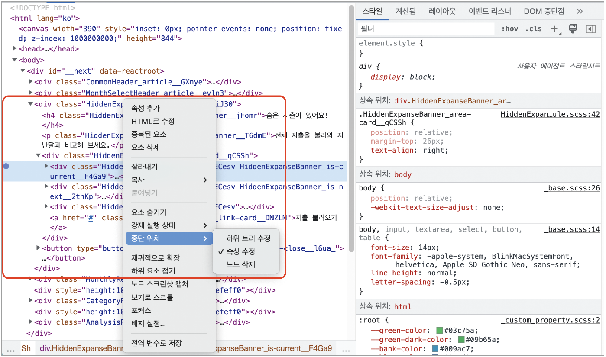
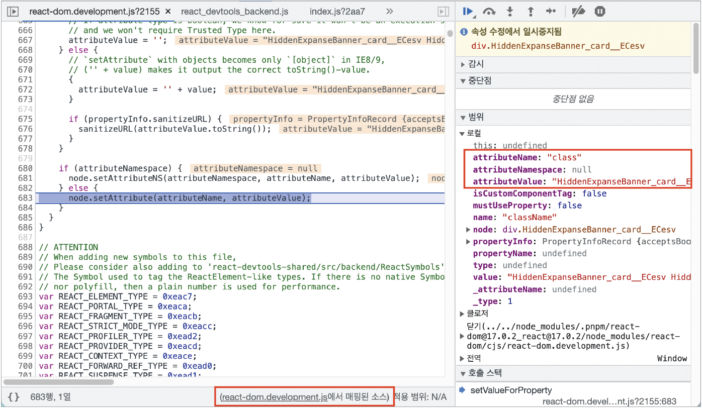
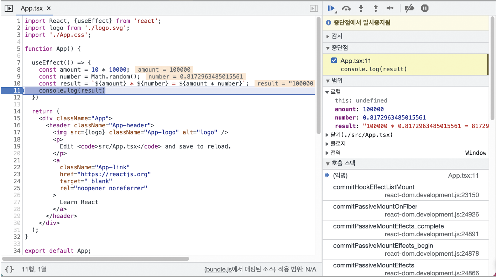
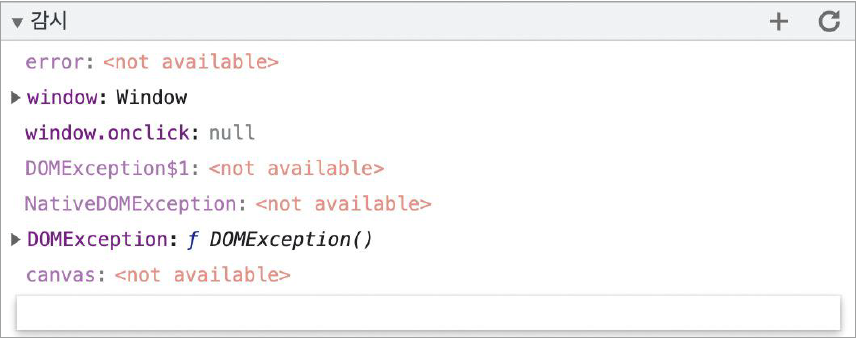
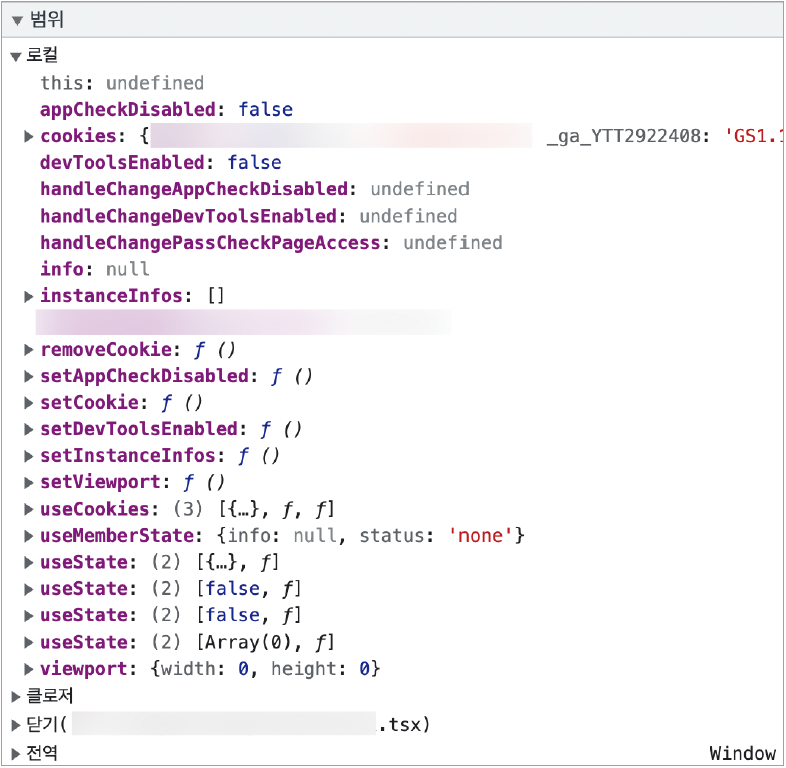
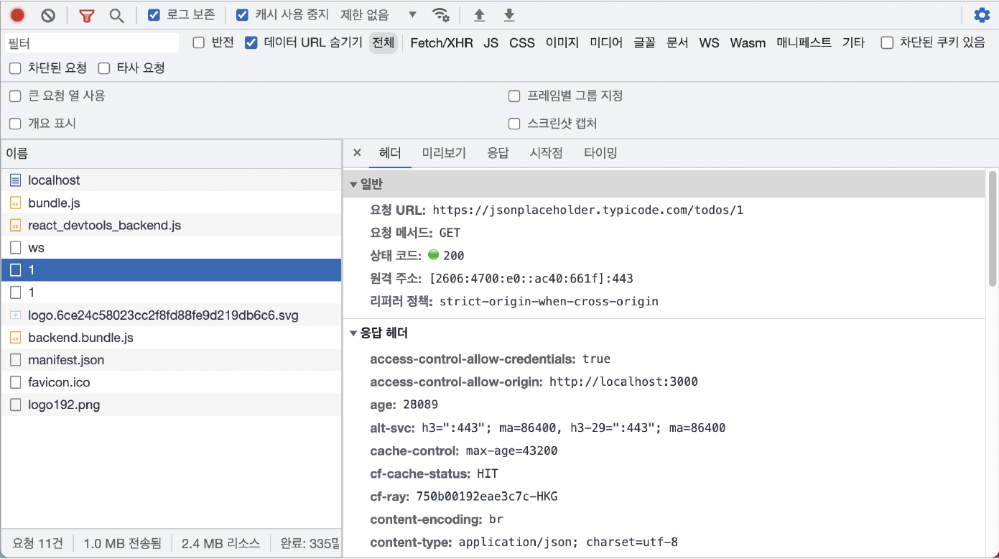
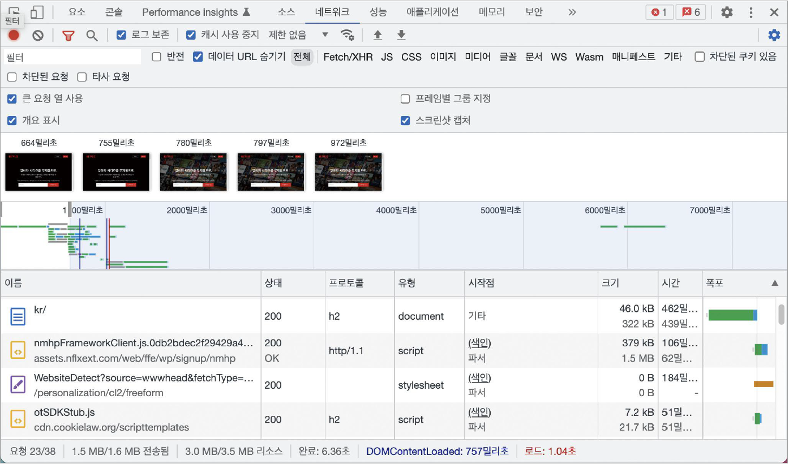

# 7. 크롬 개발자 도구를 활용한 애플리케이션 분석

- 일반적인 브라우저 환경에서 발생할 수 있는 문제를 디버깅할 수 있는 도구를 브라우저 개발자 도구라고 한다
- 브라우저 개발자 도구에서는 웹사이트를 불러올 때 발생하는 거의 대부분의 작업을 기록하고, 이와 관련된 많은 기능을 제공한다

## 7.1 크롬 개발자 도구란?

    

- 크롬 개발자 도구에서 웹사이트를 제대로 디버깅하고 싶다면 개인정보 보호 모드(시크릿 모드)에서 확장 프로그램을 꺼두고 디버깅하면 불필요한 정보를 제거할 수 있다

## 7.2 요소 탭

- 현재 웹페이지를 구성하는 HTML, CSS 등의 정보를 확인할 수 있다
  

      
  

### 7.2.1 요소 화면

- 요소 화면에서는 현재 HTML을 보고 직접 수정해서 웹페이지에서 어떻게 보이는지 빠르게 확인할 수 있다
- 코드에 의해 클래스나 속성값이 동적으로 제어되는 DOM이 있다면 요소의 중단점을 사용해 디버깅할 수 있다
  

      
      
  

### 7.2.2 요소 정보

- 스타일
  - 요소와 관련된 스타일 정보를 나타낸다
  - 어떤 클래스, 태그명, 아이디 등으로 매핑되어 설정된 스타일인지 확인할 수 있고, 또한 스타일이 선언돼 있는 파일도 확인할 수 있다
  - 요소와 마찬가지로 이 스타일 정보의 내용도 수정해 페이지에 어떻게 반영되는지 미리 확인해 볼 수 있다
- 계산됨
  - 해당 요소의 크기, 패딩(padding), 보더(border), 마진(margin)과 각종 CSS 적용 결괏값을 알 수 있는 탭이다
  - 스타일 탭은 어떤 스타일이 어디서 왔는지를 나타낸다면, 계산됨에서는 그렇게 적용된 스타일이 결과적으로 어떤 결과물로 나타나는지 확인할 수 있다
- 레이아웃
  - CSS 그리드나 레이아웃과 관련된 정보를 확인할 수 있다
- 이벤트 리스너
  - 현재 요소에 부착된 각종 이벤트 리스너를 확인할 수 있다
  - 상위 버튼을 체크 해제하면 딱 해당 요소에 명확하게 부착된 이벤트만 볼 수 있다
  - 이벤트 버블링 등으로 이벤트를 발생시키는 경우에는 확인할 수 없다
- DOM 중단점
  - 앞서 설명한 중단점이 있는지 알려주는 탭이다
- 속성
  - 해당 요소가 가지고 있는 모든 속성값을 나타낸다
  - 기본적으로 자바스크립트에서 해당 DOM으로 `.attributes`를 실행했을 때 나오는 결과와 비슷하지만 `.attributes`는 직접 할당된 값만 나오는 반면 속성 탭에는 모든 값이 나온다는 차이가 있다
  - 해당 요소가 가지고 있는 모든 값을 확인하고 싶다면 속성 탭을 확인해 보자
- 접근성
  - 접근성이란 웹 이용에 어려움을 겪는 장애인, 노약자를 위한 스크린리더기 등이 활용하는 값을 말한다
  - 접근성 탭에서는 이러한 접근성 정보를 확인할 수 있다

## 7.3 소스 탭

- 소스 탭에서는 웹 애플리케이션을 불러오기 위해 실행되거나 참조된 모든 파일을 확인할 수 있다
- 소스 탭에서 유용한 것을 살펴보려면 디버깅하고 싶은 파일을 직접 열어야 한다
- 프로덕션 모드의 경우 파일이 모두 압축돼 있기 때문에 디버깅하기 불편하지만, 개발 모드에서는 유용하게 사용할 수 있다
- 요소 탭에서 DOM 중단점을 만들어 DOM이 변경되는 과정을 디버깅해 볼 수 있었던 것과 마찬가지로 여기서도 소스 중단점을 생성해 자바스크립트 실행을 중단시키고 디버깅을 수행할 수 있다
    

        
    

- 소스 탭 오른쪽에 제공하는 정보와 기능

  - 감시 - 감시하고 싶은 변수를 선언하고, 해당 변수의 정보를 확인할 수 있는 메뉴다 - 왼쪽에서 제공하는 변수 외에 디버깅 시점에서 특정 변수의 값을 알고 싶다면 이 감시를 활용하면 된다 - 감시로 확인할 수 있는 정보가 있다면 해당 변수의 값을, 확인할 수 없는 값은 `<not available>`로 표시되는 것을 볼 수 있다

    

        
    

  - 중단점
    - 현재 웹사이트에서 추가한 중단점을 확인할 수 있다
    - 현재 열려 있는 파일뿐만 아니라 웹페이지 전체에 걸쳐 소스 탭에서 추가한 모든 중단점을 확인할 수 있다
  - 범위

    - 현재 중단점에서의 스코프를 의미한다
    - 로컬은 현재 로컬 스코프를 의미하며, 이 스코프에서 접근할 수 있는 값을 확인할 수 있다
    - 이 밖에도 클로저, 전역 스코프 등을 확인할 수 있다

    

        
    

  - 호출 스택
    - 현재 중단점의 콜스택을 확인할 수 있다
    - 자바스크립트 코드가 실행되며 생성되는 실행 콘텍스트가 어떻게 저장되어 현재 어떤 모습을 하고 있는지 직접 볼 수 있다
  - 전역 리스너
    - 현재 전역 스코프에 추가된 리스너 목록을 확인할 수 있다
  - XHR/가져오기, DOM, 이벤트 리스너, CSP 위반 중단점: 소스의 중단점 이외에 다양한 중단점을 확인할 수 있다.

## 7.4 네트워크 탭

- 해당 웹페이지를 접속하는 순간부터 발생하는 모든 네트워크 관련 동작이 기록된다
- HTTP 요청부터 웹 소켓에 이르기까지 웹페이지가 외부 데이터와 통신하는 정보를 확인하고 싶다면 네트워크 탭을 참조하면 된다

    

        
    

- Fetch/XHR, JS 등의 탭으로 보고 싶은 네트워크의 요청 종류를 필터링할 수 있다
- 해당 페이지를 불러오는 과정에서 발생한 네트워크 요청을 보며 페이지가 로딩되는 과정을 대략적으로 확인할 수 있다
- 잘못된 `useEffect`의 사용으로 인해 동일한 주소의 요청이 여러 번 실행되는 등 의도하지 않은 문제를 확인할 수 있다
- 페이지를 불러오는 동안 발생한 총 요청 건수와 총 다운로드한 업로드 리소스의 크기를 확인할 수 있다
  - 트래픽 비용뿐만 아니라 속도에도 영향을 미치는 문제이므로 가급적 네트워크 리소스 요청 횟수와 크기를 줄이는 것이 좋다
- 스크린샷 캡처 기능을 활용해 네트워크 요청 흐름에 따라 웹페이지가 어떻게 로딩되고 있는지 확인할 수 있다
    

        
    

    
  - 사용자에게 먼저 노출되거나, 노출되는 영역이 큰 중요한 콘텐츠가 우선적으로 다운로드되는지, 우선순위가 낮은 이미지가 나중에 다운로드되는지 등을 확인할 수 있다

### 네트워크 탭으로 확인할 점

- 불필요한 요청 또는 중복되는 요청이 없는지
- 웹페이지 구성에 필요한 리소스 크기가 너무 크지 않은지
- 리소스를 불러오는 속도는 적절한지 또는 너무 속도가 오래 걸리는 리소스는 없는지
- 리소스가 올바른 우선순위로 다운로드되어 페이지를 자연스럽게 만들어 가는지
