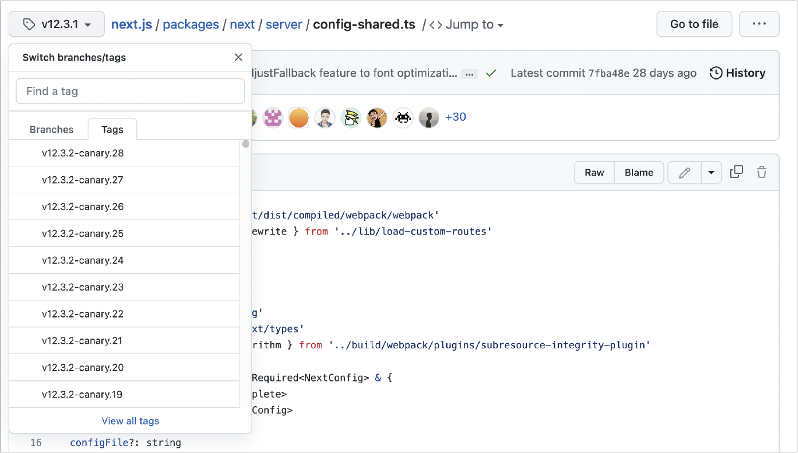

# 9. 모던 리액트 개발 도구로 개발 및 배포 환경 구축하기

## 9.1 Next.js로 리액트 개발 환경 구축하기

### 9.1.1 create-next-app 없이 하나씩 구축하기

- `npm init`을 실행하여 `package.json`을 만드는 CLI 실행

  <details>
  <summary>npm init</summary>

  ```
  » npm init
  This utility will walk you through creating a package.json file.
  It only covers the most common items, and tries to guess sensible defaults.

  See `npm help init` for definitive documentation on these fields
  and exactly what they do.

  Use `npm install <pkg>` afterwards to install a package and
  save it as a dependency in the package.json file.

  Press ^C at any time to quit.
  package name: (my-app)
  version: (1.0.0)
  description:
  entry point: (index.js)
  test command:
  git repository:
  keywords:
  license: (ISC)
  About to write to /Users/yceffort/private/react-deep-dive-example/chapter7/my-app/package.json:

  {
    "name": "my-app",
    "version": "1.0.0",
    "description": "",
    "main": "index.js",
    "scripts": {
      "test": "echo \"Error: no test specified\" && exit 1"
    },
      "author": "yceffort",
      "license": "ISC"
  }

  Is this OK? (yes)
  ```

  </details>

- `react`, `react-dom`, `next` 설치

  ```
  » npm i react react-dom next
  ```

- `devDependencies`에 필요한 패키지 설치
  ```
  » npm i @types/node @types/react @types/react-dom eslint eslint-config-next typescript --save-dev
  ```

### 9.1.2 tsconfig.json 작성하기

- `npm` 설정을 `package.json`에서 하는 것차럼 타입스크립트 설정은 `tsconfig.json`에 기록한다
- `tsconfig.json`의 `$schema` 속성은 `schemaStore`에서 제공하는 정보로, 해당 json파일이 무엇을 의미하는지, 어떤 키와 어떤 값이 들어갈 수 있는지 알려준다

  <details>
  <summary>tsconfig.json</summary>

  ```json
  {
    "$schema": "https://json.schemastore.org/tsconfig.json",
    "compilerOptions": {
      "target": "es5",
      "lib": ["dom", "dom.iterable", "esnext"],
      "allowJs": true,
      "skipLibCheck": true,
      "strict": true,
      "forceConsistentCasingInFileNames": true,
      "noEmit": true,
      "esModuleInterop": true,
      "module": "esnext",
      "moduleResolution": "node",
      "resolveJsonModule": true,
      "isolatedModules": true,
      "jsx": "preserve",
      "incremental": true,
      "baseUrl": "src",
      "paths": {
        "#pages/*": ["pages/*"],
        "#hooks/*": ["hooks/*"],
        "#types/*": ["types/*"],
        "#components/*": ["components/*"],
        "#utils/*": ["utils/*"]
      }
    },
    "include": ["next-env.d.ts", "**/*.ts", "**/*.tsx"],
    "exclude": ["node_modules"]
  }
  ```

  </details>

- `tsconfig.json`의 옵션
  - `compilerOptions`: 타입스크립트를 자바스크립트로 컴파일할 때 사용하는 옵션
    - `target`: 타입스크립트가 변환을 목표로 하는 언어의 버전
    - `strict`: 타입스크립트 컴파일러의 엄격 모드를 제어
    - `noEmit`: 컴파일을 하지 않고, 타입 체크만 한다. `Next.js`는 `swc`가 타입스크립트 파일을 컴파일하므로 굳이 타입스크립트가 자바스크립트로 컴파일할 필요가 없다.
    - `module`: 모듈 시스템을 설정한다. 대표적으로 `commonjs(require)`와 `esnext(import)`가 있다.
    - `baseUrl`: 모듈을 찾을 때 기준이 되는 디렉터리를 지정한다. 아래의 `paths`와 함께 사용한다.
    - `paths`: 일반적으로 모듈을 불러올 때 `'./'`나 `'../'`를 활용한 상대 경로를 활용하게 되는데, `paths`를 활용하여 별칭(alias)을 지정할 수 있다. 위의 경우 `'#pages/main'`의 경우 `baseUrl`과 함께 `'src/pages/main'`이라는 경로로 해석된다.
  - `include`: 타입스크립트 컴파일 대상에서 포함시킬 파일 목록
  - `exclude`: 타입스크립트 컴파일 대상에서 제외시킬 파일 목록
- 이 밖의 다양한 옵션은 [typescriptlang.org](https://www.typescriptlang.org/tsconfig) 에서 확인할 수 있다.

### 9.1.3 next.config.js 작성하기

- `Next.js` 설정을 위한 `next.config.js`를 작성한다
  <details>
  <summary>next.config.js</summary>

  ```js
  /** @type {import('next').NextConfig} */
  const nextConfig = {
    reactStrictMode: true,
    poweredByHeader: false,
    eslint: {
      ignoreDuringBuilds: true,
    },
  };

  module.exports = nextConfig;
  ```

  </details>

- `next.config.js`에서 사용 가능한 옵션은 [깃허브 저장소](https://github.com/vercel/next.js/blob/v12.3.1/packages/next/server/config-shared.ts)를 방문해 본인이 사용 중인 버전의 태그를 찾아 들어가면 확인할 수 있다.
  <div>
      
  </div>

### 9.1.4 ESLint와 Prettier 설정하기

- 일반적인 `ESLint` 작업을 수행하기 위해 가장 설치 및 설정이 쉬운 `@titicaca/eslint-config-triple`을 설치해 사용한다.
  ```
  » npm i @titicaca/eslint-config-triple --save-dev
  ```
- `@titicaca/eslint-config-triple`에 대한 설정은 [깃허브 저장소](https://github.com/titicacadev/triple-config-kit#eslint-config-triple)에 정리되어 있다.
- `eslint-config-next`와 `eslint-config-triple`이 함께 작동하게 하려면 다음과 같은 별도의 설정이 필요하다

  ```js
  const path = require('path');

  const createConfig = require('@titicaca/eslint-config-triple/create-config');

  const { extends: extendConfigs, overrides } = createConfig({
    type: 'frontend',
    project: path.resolve(__dirname, './tsconfig.json'),
  });

  module.exports = {
    extends: [...extendConfigs, 'next/core-web-vitals'],
    overrides,
  };
  ```

### 9.1.5 스타일 설정하기

- 이 프로젝트 예시에서는 `styled-component`를 사용한다

  ```
  » npm i styled-components

  » npm i @types/styled-components --save-dev
  ```

- `swc`에 `styled-components`를 사용한다는 것을 알리기 위해 `styledComponents: true`를 `next.config.js`에 추가한다
- `pages/_document.tsx`의 `Head`에 `styled-components`를 사용하기 위한 `ServerStyleSheet`를 추가한다(4.3절 'Next.js 톺아보기' 참조)
  <details>
  <summary>pages/_document.tsx</summary>

  ```js
  import Document, {
    Html,
    Head,
    Main,
    NextScript,
    DocumentContext,
    DocumentInitialProps,
  } from 'next/document';
  import { ServerStyleSheet } from 'styled-components';

  export default function MyDocument() {
    return (
      <Html lang="ko">
        <Head />
        <body>
          <Main />
          <NextScript />
        </body>
      </Html>
    );
  }

  MyDocument.getInitialProps = async (
    ctx: DocumentContext
  ): Promise<DocumentInitialProps> => {
    const sheet = new ServerStyleSheet();
    const originalRenderPage = ctx.renderPage;

    try {
      ctx.renderPage = () =>
        originalRenderPage({
          enhanceApp: (App) => (props) =>
            sheet.collectStyles(<App {...props} />),
        });

      const initialProps = await Document.getInitialProps(ctx);
      return {
        ...initialProps,
        styles: (
          <>
            {initialProps.styles}
            {sheet.getStyleElement()}
          </>
        ),
      };
    } finally {
      sheet.seal();
    }
  };
  ```

  </details>

### 9.1.6 애플리케이션 코드 작성

- `Next.js` 애플리케이션의 폴더 구조는 `src/pages`하단에 실제 페이지 라우팅과 관련된 파일을 기재해야 한다는 컨벤션만 지키면 된다
- [JSONPlaceholder](https://jsonplaceholder.typicode.com/) 에서 제공하는 `todo API`를 `getServerSideProps`에서 불러와 렌더링하는 간단한 예시 프로젝트의 기본적인 폴더 구조
  <details>
  <summary>폴더 구조 예시</summary>

  ```
  📦my-app
  ┣ 📂src
  ┃ ┣ 📂components
  ┃ ┃ ┣ 📂common
  ┃ ┃ ┃ ┗ 📜title.tsx
  ┃ ┃ ┗ 📂todo
  ┃ ┃ ┃ ┗ 📜todo.tsx
  ┃ ┣ 📂hooks
  ┃ ┃ ┗ 📜useToggle.ts
  ┃ ┣ 📂pages
  ┃ ┃ ┣ 📂todos
  ┃ ┃ ┃ ┗ 📜[id].tsx
  ┃ ┃ ┣ 📜_document.tsx
  ┃ ┃ ┗ 📜index.tsx
  ┃ ┣ 📂types
  ┃ ┃ ┗ 📜todo.ts
  ┃ ┗ 📂utils
  ┃ ┃ ┗ 📂errors
  ┃ ┃ ┃ ┗ 📜index.ts
  ┣ 📜.eslintrc.js
  ┣ 📜.gitignore
  ┣ 📜.prettierignore
  ┣ 📜.prettierrc
  ┣ 📜next-env.d.ts
  ┣ 📜next.config.js
  ┣ 📜package-lock.json
  ┣ 📜package.json
  ┗ 📜tsconfig.json
  ```

  </details>

- `package.json`에 Next.js 프로젝트 실행, 빌드, 린트와 관련된 명령어를 기재

  ```json
  {
    "//": "생략",
    "scripts": {
      "dev": "next dev",
      "start": "next start",
      "build": "next build",
      "lint:es": "eslint '**/*.{js,ts,tsx}'",
      "lint:es:fix": "npm run lint:es -- --fix",
      "prettier": "prettier '**/*' --check",
      "prettier:fix": "prettier '**/*' --write"
    },
    "//": "생략"
  }
  ```

- 예제 코드는 [깃허브 저장소](https://github.com/wikibook/react-deep-dive-example/tree/main/chapter9/zero-to-next)에서 확인할 수 있다

### 9.1.7 정리

- 프로젝트를 새로 만들 때마다 똑같은 설정을 반복하지 않기 위한 방법

  1. <b>Template repository</b>

  - 보일러플레이트 프로젝트를 만든 다음, 깃허브에서 "Template repository" 옵션을 체크한다
      <div>
          
      </div>
  - 다른 저장소를 생성할 때 해당 내용을 복사해서 생성할 수 있다
      <div>
          
      </div>
  - 템플릿으로 저장소를 생성하면 저장소명과 함께 ‘generated from’이라는 메시지로 어떤 템플릿에서 만들어진 저장소인지 확인할 수 있게 된다
      <div>
          
      </div>

  2. <b>create-\*\*\*-app</b>

  - `create-next-app`에서 한 발 더 나아가 나만의 `create-***-app`을 만든다
  - cli 패키지로 만든다면 `create-next-app`과 마찬가지로 사용자의 입력을 받아 서로 다른 패키지를 만들 수 있다
  - 앞선 방법보다 훨씬 더 손이 많이 가지만 조직 내에서 마이크로서비스를 지향하고 있고, 앞으로 생성해야 할 프로젝트 또한 많다면 충분히 검토해 볼 만하다
  - 다음 두 사이트를 참고해 `create-***-app`을 한번 직접 구현해 보자
    - `create-next-app` 내부의 코드: [create-next-app의 소스코드](https://github.com/vercel/next.js/blob/canary/packages/create-next-app/index.ts)를 살펴보면 알겠지만 일단 하나의 템플릿을 미리 만들어 둔 다음, 여기에서 CLI로 사용자의 입력을 받아 커스터마이징한 것을 알 수 있다.
    - [Creating a CLI tool with Node.js](https://blog.logrocket.com/creating-a-cli-tool-with-node-js/) : npm을 기반으로 CLI 패키지를 만드는 방법을 상세하게 설명하고 있다.
